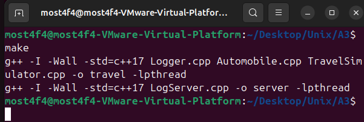
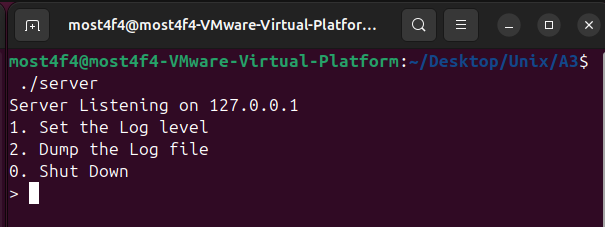
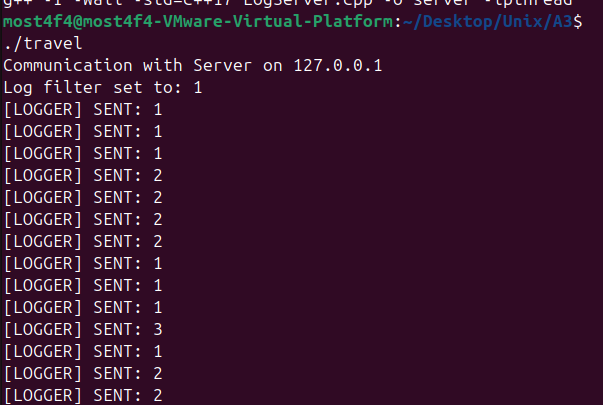
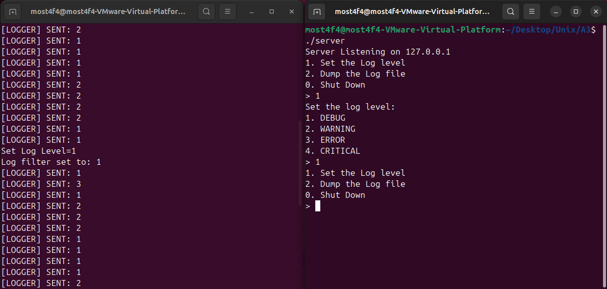
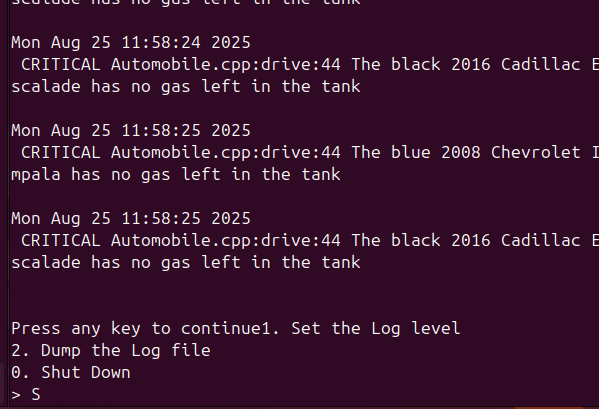
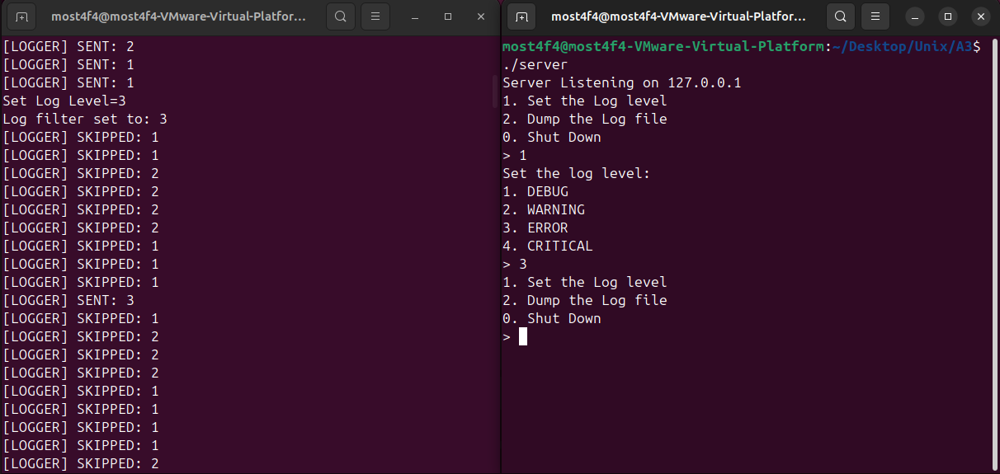

# Embedded Distributed Logging System with UDP Communication

## Overview

This project implements a **real-time distributed logging system** using **UDP socket communication**, **multithreading**, and **asynchronous I/O**. The system demonstrates advanced network programming concepts with a practical travel simulation that generates structured logs across different severity levels.

## Key Features

- **Asynchronous UDP Communication**: Non-blocking socket operations for high-performance logging
- **Multi-threaded Architecture**: Concurrent log processing and network I/O
- **Dynamic Log Level Control**: Real-time filtering adjustment from server console
- **Embedded Logger Integration**: Seamlessly integrated into application code with macro support
- **Thread-Safe Operations**: Mutex synchronization for shared resource protection
- **Structured Log Format**: Timestamped entries with file/function/line information
- **Interactive Server Management**: Live log dumping and configuration

## System Architecture

### Components Overview

```
┌─────────────────┐    UDP Socket    ┌─────────────────┐
│  Travel Client  │ ◄──────────────► │   Log Server    │
│   (Logger.cpp)  │   Port: 8080     │(LogServer.cpp)  │
│                 │   127.0.0.1      │                 │
├─────────────────┤                  ├─────────────────┤
│ Automobile Sim  │                  │ File I/O Thread │
│ TravelSim.cpp   │                  │ Network Thread  │
└─────────────────┘                  └─────────────────┘
```

### 1. **Logger Client (`Logger.cpp`)**

- **UDP Socket Client**: Establishes connection to log server
- **Thread-Safe Logging**: Mutex-protected log message formatting
- **Dynamic Level Filtering**: Receives and processes server commands
- **Non-blocking I/O**: Asynchronous message sending/receiving

### 2. **Log Server (`LogServer.cpp`)**

- **UDP Socket Server**: Listens for incoming log messages
- **Multi-threaded Processing**: Separate threads for network I/O and user interaction
- **File Management**: Persistent log storage with concurrent access control
- **Interactive Console**: Real-time configuration and log inspection

### 3. **Travel Simulator (`TravelSimulator.cpp` + `Automobile.cpp`)**

- **Business Logic Simulation**: Realistic automobile operations
- **Embedded Logging**: Contextual log generation at critical points
- **Error Condition Handling**: Demonstrates various log levels

## Technical Implementation

### UDP Communication Protocol

```cpp
// Message Structure
struct LogMessage {
    timestamp: "Mon Jan 1 12:00:00 2025"
    level: "DEBUG|WARNING|ERROR|CRITICAL"
    location: "file.cpp:function:line"
    message: "Application-specific content"
}
```

### Log Level Hierarchy

| Level        | Value | Usage               | Example Scenario      |
| ------------ | ----- | ------------------- | --------------------- |
| **DEBUG**    | 1     | Development tracing | Function entry/exit   |
| **WARNING**  | 2     | Potential issues    | Fuel tank overflow    |
| **ERROR**    | 3     | Recoverable errors  | Empty fuel tank       |
| **CRITICAL** | 4     | System failures     | Network disconnection |

### Threading Architecture

#### **Server Side**

- **Main Thread**: User interface and menu handling
- **Receive Thread** (`receive_func`): Non-blocking UDP message reception
- **Mutex Protection**: File I/O and shared data synchronization

#### **Client Side**

- **Main Thread**: Application logic and log generation
- **Receive Thread**: Server command processing (log level changes)
- **Mutex Protection**: Socket operations and shared variables

### Socket Configuration

```cpp
// Non-blocking socket setup
int socket_flags = fcntl(socket_fd, F_GETFL, 0);
fcntl(socket_fd, F_SETFL, socket_flags | O_NONBLOCK);

// UDP socket creation
int socket_fd = socket(AF_INET, SOCK_DGRAM, 0);

// Server binding
bind(server_socket, (struct sockaddr*)&server_addr, sizeof(sockaddr_in));
```

## Build and Run Instructions

### Prerequisites

- **Operating System**: Linux/Unix (tested on Ubuntu 22.04)
- **Compiler**: g++ with C++17 support
- **Libraries**: pthread (POSIX threads)
- **Network**: Localhost access (127.0.0.1)

### Compilation

```bash
# Build both executables
make

# This creates:
# - server (Log Server)
# - travel (Travel Simulator with embedded Logger)
```


_Successful compilation showing both executables created_

### Execution Workflow

#### 1. Start the Log Server

```bash
./server
```

**Server Menu Options:**

```
1. Set the Log level
2. Dump the Log file
0. Shut Down
```


_Log server initialization and menu display_

#### 2. Run the Travel Simulator

In a **separate terminal**:

```bash
./travel
```


_Travel simulator generating logs with automobile operations_

#### 3. Dynamic Log Level Control

From the server console, select option 1:

```
Set the log level:
1. DEBUG
2. WARNING
3. ERROR
4. CRITICAL
```


_Server sending log level change command to client_

#### 4. Real-time Log Monitoring

Server console shows received logs:

```
Server Listening on 127.0.0.1
Mon Jan 1 12:00:00 2025 WARNING Automobile.cpp:addFuel:25 The red 2020 Honda Civic is full of gas. Discarding the rest...
Mon Jan 1 12:00:05 2025 ERROR Automobile.cpp:drive:35 The red 2020 Honda Civic has no gas left in the tank
```

#### 5. Log File Dumping

Select option 2 from server menu to view complete log history:


_Complete log file contents displayed in server console_

### Advanced Usage

#### Filtering by Log Level

When log level is set to **ERROR** (3), only ERROR and CRITICAL messages pass through:


_Client-side filtering showing only ERROR and CRITICAL messages_

#### Network Communication Flow

```bash
# Client → Server: Log Message
./travel generates: "WARNING: Fuel tank overflow"
UDP packet sent to 127.0.0.1:8080

# Server → Client: Configuration
Server sends: "Set Log Level=3"
Client receives and updates filter
```

## Code Architecture Deep Dive

### Logger Integration

```cpp
// Embedded logging in application code
void Automobile::addFuel(double _liters) {
    fuelInTank += _liters;
    if(fuelInTank > 50) {
        fuelInTank = 50;
        char message[64];
        sprintf(message, "The %s %d %s %s is full of gas. Discarding the rest...\n",
                colour.c_str(), year, make.c_str(), model.c_str());
        Log(WARNING, __FILE__, __func__, __LINE__, message);
    }
}
```

### Thread-Safe Log Processing

```cpp
void Log(LOG_LEVEL level, const char* file, const char* func, int line, const char* message) {
    if (level < log_filter) {
        return; // Client-side filtering
    }

    pthread_mutex_lock(&lock);
    // Format message with timestamp
    time_t now = time(0);
    char* dt = ctime(&now);
    len = sprintf(buf, "%s %s %s:%s:%d %s\n", dt, levelStr[level], file, func, line, message);

    // Send via UDP
    sendto(socket_fd, buf, len, 0, (struct sockaddr*)&addr, sizeof(addr));
    pthread_mutex_unlock(&lock);
}
```

### Non-blocking Server Reception

```cpp
void* receive_func(void* arg) {
    while (is_running) {
        ssize_t num_bytes = recvfrom(socket_fd, buffer, sizeof(buffer), 0,
                                   (struct sockaddr*)&client_addr, &client_addr_len);

        if (num_bytes == -1) {
            if (errno == EWOULDBLOCK || errno == EAGAIN) {
                continue; // No data available, try again
            }
        }

        // Process received log entry
        pthread_mutex_lock(&lock);
        write_to_logfile(buffer, num_bytes);
        pthread_mutex_unlock(&lock);
    }
}
```

## Educational Value

### Network Programming Concepts

1. **UDP vs TCP**: Understanding connectionless communication
2. **Non-blocking I/O**: Asynchronous socket operations
3. **Client-Server Architecture**: Distributed system design
4. **Network Byte Order**: Proper address/port conversion

### Concurrency and Synchronization

1. **Multi-threading**: Concurrent execution patterns
2. **Mutex Synchronization**: Thread-safe shared resource access
3. **Race Condition Prevention**: Critical section protection
4. **Thread Lifecycle Management**: Creation, joining, cleanup

### System Programming

1. **Signal Handling**: Graceful shutdown on SIGINT
2. **File I/O Operations**: Log file management
3. **Process Communication**: Inter-process messaging
4. **Error Handling**: Robust error detection and recovery

## Testing and Validation

### Test Scenarios

1. **Basic Logging**: Verify all log levels are transmitted correctly
2. **Dynamic Filtering**: Test real-time log level changes
3. **Thread Safety**: Concurrent log generation and reception
4. **Network Resilience**: Handle connection issues gracefully
5. **File Operations**: Ensure log persistence and concurrent access

### Performance Characteristics

- **Throughput**: Handles hundreds of log messages per second
- **Latency**: Sub-millisecond local UDP communication
- **Memory Usage**: Minimal footprint with efficient buffering
- **Scalability**: Easily extended to multiple clients

## Troubleshooting

### Common Issues

1. **Port Already in Use**

   ```bash
   netstat -tulpn | grep 8080
   kill -9 <process_id>
   ```

2. **Permission Denied on Log File**

   ```bash
   chmod 666 logServer.log
   ```

3. **Socket Creation Failed**

   ```bash
   # Check system limits
   ulimit -n
   # Increase if needed
   ulimit -n 4096
   ```

4. **Thread Creation Errors**
   ```bash
   # Check pthread library linking
   ldd ./server | grep pthread
   ```

## File Structure

```
├── Makefile                 # Build configuration and targets
├── README.md               # Project documentation
├── Logger.h                # Logger interface definitions
├── Logger.cpp              # UDP client logger implementation
├── LogServer.cpp           # UDP server log receiver
├── Automobile.h            # Vehicle class interface
├── Automobile.cpp          # Vehicle simulation logic
├── TravelSimulator.cpp     # Main application with embedded logging
├── logServer.log          # Generated log file (created at runtime)
└── screenshots/           # Documentation images
    ├── picture1.png
    ├── picture2.png
    ├── picture3.png
    ├── picture4.png
    ├── picture5.png
    ├── picture6.png
    ├── picture7.png
    ├── picture8.png
    └── picture9.png
```

## Future Enhancements

### Potential Improvements

1. **Multiple Client Support**: Handle multiple simultaneous loggers
2. **Log Rotation**: Automatic log file rotation based on size/time
3. **Network Security**: Encryption for sensitive log data
4. **Configuration Files**: External configuration management
5. **Web Dashboard**: Real-time log viewing via web interface
6. **Database Storage**: Log persistence in structured database
7. **Load Balancing**: Distribute logs across multiple servers

### Advanced Features

1. **Log Aggregation**: Combine logs from multiple sources
2. **Search and Filter**: Advanced log querying capabilities
3. **Alerting System**: Notification on critical events
4. **Performance Metrics**: System monitoring and analytics

## Dependencies

- **g++**: C++17 compatible compiler
- **pthread**: POSIX threads library
- **Linux System Calls**: socket(), bind(), sendto(), recvfrom()
- **Standard Libraries**: iostream, cstring, ctime, errno

## Video Demonstration

[📹 YouTube Demo](https://youtu.be/zC8kLWvraT4) - Complete system walkthrough and feature demonstration

## License

This program is for educational purposes and is free to use and modify under the MIT License.

## Author

**Mostafa Hasanalipourshahrabadi**

- Advanced network programming and system design
- Demonstrates production-ready logging architecture
- Tested and validated on Linux VM environments

---

_This project showcases enterprise-level logging system concepts in a educational, hands-on implementation. Perfect for understanding distributed systems, network programming, and concurrent system design._
