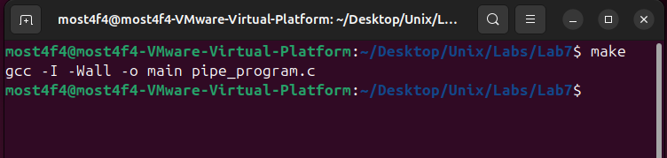
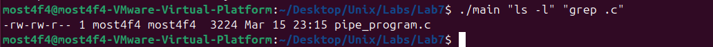
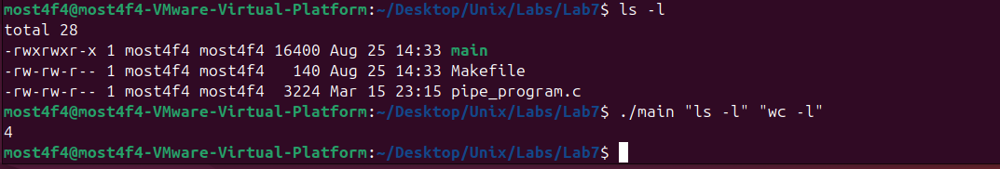
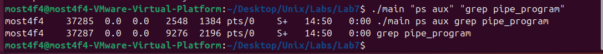
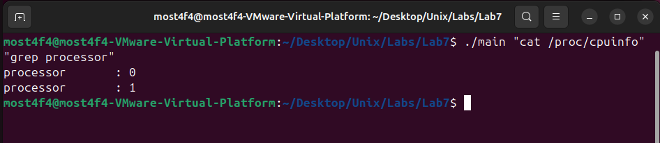
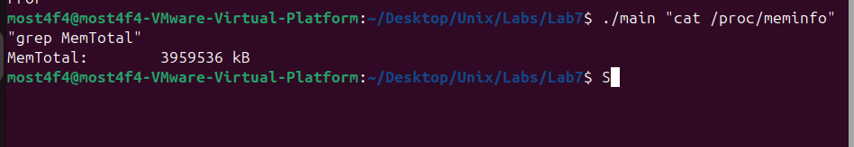

# Unix Pipe Programming - Inter-Process Communication System

## Overview

This project implements a **Unix shell pipeline simulator** demonstrating advanced **Inter-Process Communication (IPC)** using **anonymous pipes**, **process forking**, **I/O redirection**, and **command execution**. The system replicates the functionality of shell command pipelines (e.g., `command1 | command2`) by creating two child processes connected via a pipe, where the output of the first command becomes the input of the second command.

## Key Features

- **Anonymous Pipe Communication**: High-performance IPC using kernel-managed pipes
- **Process Forking**: Dynamic child process creation with `fork()`
- **I/O Redirection**: File descriptor manipulation with `dup2()`
- **Command Execution**: Dynamic program loading with `execlp()`
- **Argument Parsing**: String tokenization with `strtok()`
- **Process Synchronization**: Parent-child coordination with `waitpid()`
- **Error Handling**: Comprehensive system call error checking
- **Resource Management**: Proper file descriptor cleanup

## System Architecture

### Process Hierarchy

```
                    ┌────────────────────────┐
                    │   PARENT PROCESS       │
                    │   (pipe_program)       │
                    │                        │
                    │ • Creates pipe         │
                    │ • Forks children       │
                    │ • Manages cleanup      │
                    │ • Waits for completion │
                    └──────────┬─────────────┘
                               │
                    ┌──────────▼──────────┐
                    │      fork()         │
                    └──────────┬──────────┘
                               │
        ┌──────────────────────┼──────────────────────┐
        ▼                      ▼                      ▼
┌─────────────────┐    ┌─────────────┐    ┌─────────────────┐
│   CHILD 1       │    │    PIPE     │    │   CHILD 2       │
│   (Writer)      │    │             │    │   (Reader)      │
│                 │    │ ┌─────────┐ │    │                 │
│ • Executes cmd1 │───►│ │ Buffer  │ │───►│ • Executes cmd2 │
│ • stdout → pipe │    │ │ (Kernel)│ │    │ • stdin ← pipe  │
│ • dup2(pipe, 1) │    │ └─────────┘ │    │ • dup2(pipe, 0) │
│ • execlp(cmd1)  │    │             │    │ • execlp(cmd2)  │
└─────────────────┘    └─────────────┘    └─────────────────┘
```

### Pipe Communication Model

```
File Descriptors:
┌─────────────────────────────────────────────────────────────────┐
│ pipefd[0] = Read End    │    pipefd[1] = Write End              │
├─────────────────────────┼───────────────────────────────────────┤
│ Child 2: stdin ← pipe   │    Child 1: stdout → pipe             │
│ dup2(pipefd[0], 0)      │    dup2(pipefd[1], 1)                 │
└─────────────────────────┴───────────────────────────────────────┘

Data Flow:
Command 1 Output → Kernel Pipe Buffer → Command 2 Input
```

## Technical Implementation

### Argument Parsing and Tokenization

```c
// Dynamic argument tokenization
char* token = strtok(argument1, " ");
while (token != NULL) {
    strcpy(arg1[len1], token);
    token = strtok(NULL, " ");
    ++len1;
}

// NULL-terminated argument arrays for execv family
char* arr1[len1 + 1];
for (int i = 0; i < len1; ++i) {
    arr1[i] = arg1[i];
}
arr1[len1] = NULL;  // Required for execlp()
```

### Pipe Creation and Management

```c
// Create bidirectional pipe
int pipefd[2];
if (pipe(pipefd) == -1) {
    perror("pipe");
    exit(-1);
}

// pipefd[0] = read end (file descriptor)
// pipefd[1] = write end (file descriptor)
```

### Process Creation and I/O Redirection

#### **Child Process 1 (Writer)**

```c
if (pid1 == 0) {  // Child process
    close(pipefd[0]);           // Close unused read end
    dup2(pipefd[1], STDOUT_FILENO);  // Redirect stdout to pipe
    close(pipefd[1]);           // Close original write end

    // Execute command (replaces process image)
    execlp(arr1[0], arr1[0], arr1[1], (char*)NULL);
    perror("execlp failed");   // Only reached if exec fails
    exit(1);
}
```

#### **Child Process 2 (Reader)**

```c
if (pid2 == 0) {  // Child process
    close(pipefd[1]);           // Close unused write end
    dup2(pipefd[0], STDIN_FILENO);   // Redirect stdin from pipe
    close(pipefd[0]);           // Close original read end

    // Execute command (replaces process image)
    execlp(arr2[0], arr2[0], arr2[1], (char*)NULL);
    perror("execlp");          // Only reached if exec fails
    exit(1);
}
```

### Process Synchronization

```c
// Parent closes all pipe ends (important!)
close(pipefd[0]);
close(pipefd[1]);

// Wait for both children to complete
waitpid(pid1, NULL, 0);  // Wait for writer child
waitpid(pid2, NULL, 0);  // Wait for reader child
```

## Build and Run Instructions

### Prerequisites

- **Operating System**: Linux/Unix with POSIX compliance
- **Compiler**: GCC with C99 support
- **System Calls**: `fork()`, `pipe()`, `dup2()`, `execlp()`, `waitpid()`
- **Commands**: Any valid Unix commands in `$PATH`

### Compilation

```bash
# Using Makefile
make

# Or manually
gcc -Wall -o main pipe_program.c
```


_Successful compilation of the pipe program_

### Usage Syntax

```bash
./main "<command1> [args]" "<command2> [args]"
```

### Example Usage Scenarios

#### 1. **File Listing with Filtering**

```bash
./main "ls -l" "grep .c"
```

**Expected Output:**

```
-rw-r--r-- 1 user user 2847 Mar 25 14:30 pipe_program.c
```


_Listing files and filtering for .c extensions_

#### 1. **File Listing with Filtering - Example 2**

```bash
./main "ls -l" "wc -l"
```


_Listing files and filtering for .c extensions_

#### 2. **Process Monitoring**

```bash
./main "ps aux" "grep pipe_program"
```


_Two child processes were created (PIDs 37285, 37287), ps aux output was successfully piped to grep, grep correctly found processes containing "pipe_program"_

#### 3. **System Information Processing**

```bash
./pipe_program "cat /proc/cpuinfo" "grep 'processor'"
```


_Processing system information through pipeline_

#### 4. **Network Analysis**

```bash
./pipe_program "netstat -an" "grep 'LISTEN'"
```


_Processing Network information through pipeline_

#### 5. **Memory Information**

```bash
./pipe_program "cat /proc/meminfo" "grep 'MemTotal'"
```


_Analyzing memory information through pipeline_

### Complex Pipeline Examples

#### **Word Counting**

```bash
./pipe_program "cat pipe_program.c" "wc -l"
```

#### **Memory Usage Analysis**

```bash
./pipe_program "free -h" "grep 'Mem'"
```

#### **Directory Size Calculation**

```bash
./pipe_program "du -h" "sort -hr"
```

## Advanced Implementation Details

### File Descriptor Management

```c
// Proper file descriptor lifecycle management
Parent Process:
┌─────────────────────────────────────────────────────────────────┐
│ 1. pipe(pipefd) → Creates read/write ends                       │
│ 2. fork() → Child1 inherits both ends                           │
│ 3. fork() → Child2 inherits both ends                           │
│ 4. close(pipefd[0]) → Parent closes read end                    │
│ 5. close(pipefd[1]) → Parent closes write end                   │
│ 6. waitpid() → Waits for children                               │
└─────────────────────────────────────────────────────────────────┘

Child 1 (Writer):
┌─────────────────────────────────────────────────────────────────┐
│ 1. close(pipefd[0]) → Closes unused read end                    │
│ 2. dup2(pipefd[1], STDOUT_FILENO) → Redirects stdout            │
│ 3. close(pipefd[1]) → Closes original write end                 │
│ 4. execlp() → Replaces process image                            │
└─────────────────────────────────────────────────────────────────┘

Child 2 (Reader):
┌─────────────────────────────────────────────────────────────────┐
│ 1. close(pipefd[1]) → Closes unused write end                   │
│ 2. dup2(pipefd[0], STDIN_FILENO) → Redirects stdin              │
│ 3. close(pipefd[0]) → Closes original read end                  │
│ 4. execlp() → Replaces process image                            │
└─────────────────────────────────────────────────────────────────┘
```

### Command Execution Strategy

The program supports commands with 0-2 arguments through conditional execution:

```c
// Dynamic argument handling based on parsed length
if (len1 == 1) {
    execlp(arr1[0], arr1[0], (char*)NULL);          // command
} else if (len1 == 2) {
    execlp(arr1[0], arr1[0], arr1[1], (char*)NULL);  // command arg1
} else if (len1 == 3) {
    execlp(arr1[0], arr1[0], arr1[1], arr1[2], (char*)NULL);  // command arg1 arg2
}
```

### Memory Management

```c
// Stack-based memory allocation (no malloc required)
#define LEN 32

char arg1[3][LEN];  // Static allocation for tokenized arguments
char arg2[3][LEN];  // Automatic cleanup on function exit

// Pointer arrays for exec family functions
char* arr1[len1 + 1];  // VLA (Variable Length Array)
char* arr2[len2 + 1];  // Automatically cleaned up
```

## Error Handling and Robustness

### Comprehensive Error Checking

```c
// System call error handling
if (pipe(pipefd) == -1) {
    perror("pipe");        // Print system error message
    exit(-1);              // Terminate with error code
}

// Process creation verification
pid_t pid1 = fork();
if (pid1 == -1) {
    perror("fork");
    exit(-1);
}

// Command execution failure handling
execlp(arr1[0], arr1[0], arr1[1], (char*)NULL);
perror("execlp failed");  // Only reached if exec fails
exit(1);                  // Child exits with error
```

### Common Error Scenarios

1. **Command Not Found**

   ```bash
   ./pipe_program "nonexistent_cmd" "cat"
   # Output: execlp failed: No such file or directory
   ```

2. **Insufficient Arguments**

   ```bash
   ./pipe_program "ls"
   # Output: Not enough arguments are provided.
   ```

3. **Permission Denied**
   ```bash
   ./pipe_program "cat /root/.bashrc" "head"
   # Output: cat: /root/.bashrc: Permission denied
   ```

## Performance Analysis

### System Call Overhead

```c
Performance Characteristics:
┌─────────────────────┬──────────────────────────────────────┐
│ Operation           │ Time Complexity                      │
├─────────────────────┼──────────────────────────────────────┤
│ pipe()              │ O(1) - Kernel pipe allocation        │
│ fork()              │ O(n) - Copy-on-write page tables     │
│ dup2()              │ O(1) - File descriptor manipulation  │
│ execlp()            │ O(m) - Program loading and parsing   │
│ waitpid()           │ O(1) - Process state checking        │
└─────────────────────┴──────────────────────────────────────┘
```

### Memory Usage

- **Pipe Buffer Size**: 64KB (typical Linux default)
- **Process Memory**: Minimal overhead (~4KB per process)
- **Stack Usage**: ~256 bytes for argument arrays
- **File Descriptors**: 2 per pipe, automatically cleaned up

### Throughput Analysis

```bash
# Measure pipeline performance
time ./pipe_program "yes" "head -1000000" > /dev/null

# Compare with native shell pipeline
time bash -c "yes | head -1000000" > /dev/null
```

## Educational Objectives

### System Programming Concepts

1. **Process Management**: `fork()`, process creation, and parent-child relationships
2. **Inter-Process Communication**: Anonymous pipes for data exchange
3. **I/O Redirection**: File descriptor manipulation with `dup2()`
4. **Program Execution**: `exec` family functions for dynamic program loading

### Unix Philosophy

1. **"Do One Thing Well"**: Each command focuses on a specific task
2. **"Programs as Filters"**: Data flows through transformation stages
3. **"Text as Universal Interface"**: Commands communicate via text streams
4. **"Composition over Monoliths"**: Complex tasks via simple component combination

### Advanced Topics

1. **File Descriptor Inheritance**: How child processes inherit parent's file descriptors
2. **Process Synchronization**: Coordinating multiple processes with `waitpid()`
3. **Resource Management**: Proper cleanup of system resources
4. **Error Propagation**: How errors flow through process pipelines

## Debugging and Testing

### Debug Mode Implementation

```c
#ifdef DEBUG
    fprintf(stderr, "Created pipe: read_fd=%d, write_fd=%d\n", pipefd[0], pipefd[1]);
    fprintf(stderr, "Child1 PID: %d, Child2 PID: %d\n", pid1, pid2);
    fprintf(stderr, "Command1: %s, Command2: %s\n", arr1[0], arr2[0]);
#endif
```

### Compile with Debug Information

```bash
gcc -DDEBUG -Wall -g -o pipe_program pipe_program.c
```

### Testing Framework

```bash
#!/bin/bash
# test_pipeline.sh

echo "Testing basic functionality..."
./pipe_program "echo 'hello world'" "cat"

echo "Testing file operations..."
./pipe_program "ls -la" "wc -l"

echo "Testing error handling..."
./pipe_program "nonexistent_command" "cat"

echo "Testing complex pipeline..."
./pipe_program "ps aux" "grep 'root'"
```

## Troubleshooting

### Common Issues

1. **Zombie Processes**

   ```bash
   # Check for zombie processes
   ps aux | grep -E "defunct|<zombie>"

   # Solution: Ensure waitpid() calls complete
   ```

2. **Broken Pipe Errors**

   ```bash
   # Occurs when writer continues after reader exits
   # Solution: Proper file descriptor management
   ```

3. **File Descriptor Leaks**

   ```bash
   # Monitor file descriptor usage
   lsof -p <process_id>

   # Solution: Close all unused file descriptors
   ```

4. **Command Path Issues**

   ```bash
   # Verify command exists in PATH
   which <command_name>

   # Solution: Use absolute paths or verify PATH
   ```

## Extensions and Enhancements

### Potential Improvements

1. **Dynamic Argument Count**: Support unlimited command arguments
2. **Multiple Pipes**: Chain more than two commands (`cmd1 | cmd2 | cmd3`)
3. **Background Execution**: Support for background processes (`&`)
4. **I/O Redirection**: File input/output redirection (`<`, `>`, `>>`)
5. **Environment Variables**: Support for environment variable expansion
6. **Built-in Commands**: Implement shell built-ins (`cd`, `export`, `exit`)

### Advanced Features

```c
// Enhanced argument parsing
#define MAX_ARGS 16
#define MAX_COMMANDS 8

struct command {
    char* args[MAX_ARGS];
    int argc;
};

struct pipeline {
    struct command commands[MAX_COMMANDS];
    int command_count;
};
```

## File Structure

```
├── Makefile              # Build configuration
├── README.md            # Project documentation
├── pipe_program.c       # Main program implementation
└── screenshots/         # Documentation images
    ├── cpuinfo_example.png
    ├── make_build.png
    ├── ls_grep_example.png
    ├── ls_wc_example.png
    ├── process_monitor.png
    ├── meminfo_example.png
    └── netstat_example.png
```

## Real-World Applications

### Shell Implementation

This program demonstrates core concepts used in Unix shells:

- **Bash**: Pipeline implementation
- **Zsh**: Process management
- **Fish**: Command execution

### System Administration

```bash
# Log analysis
./pipe_program "tail /var/log/syslog" "grep 'ERROR'"

# Resource monitoring
./pipe_program "top -bn1" "grep 'Cpu'"

# Network debugging
./pipe_program "netstat -tuln" "grep ':80'"
```

### Development Tools

```bash
# Code analysis
./pipe_program "find . -name '*.c'" "wc -l"

# Build system integration
./pipe_program "make -n" "grep 'gcc'"
```

## Dependencies

- **Compiler**: GCC with C99 support
- **System Libraries**:
  - `unistd.h` (POSIX system calls)
  - `sys/wait.h` (Process control)
  - `string.h` (String manipulation)
- **Operating System**: Linux/Unix with process support
- **Commands**: Any executable in system `$PATH`

## Video Demonstration

[📹 YouTube Demo](https://youtu.be/c1SODPgvzO4) - Complete walkthrough with multiple pipeline examples

## License

This program is for educational purposes and is free to use and modify.

## Author

**Mostafa Hasanalipourshahrabadi**

- Advanced Unix system programming and IPC concepts
- Process management and file descriptor manipulation
- Shell implementation fundamentals
- Tested and validated on Linux VM environments

---

_This project provides hands-on experience with fundamental Unix concepts including process creation, inter-process communication, and I/O redirection - essential knowledge for system programming and shell implementation._
