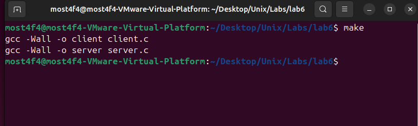
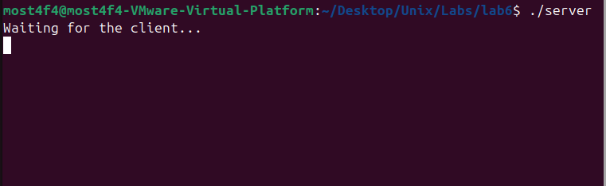
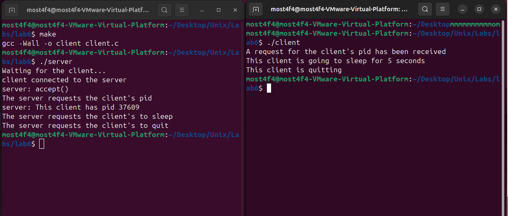
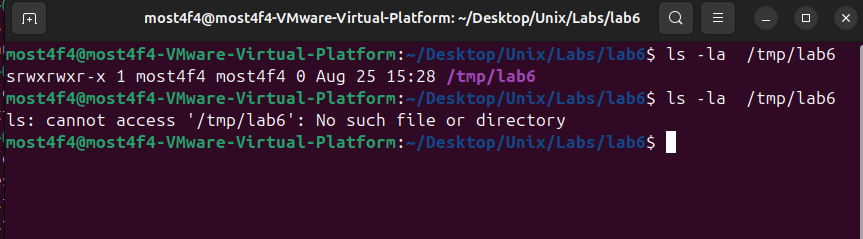

# Unix Domain Socket Client-Server Communication System

## Overview

This project demonstrates advanced **Inter-Process Communication (IPC)** using **Unix Domain Sockets** with **SOCK_STREAM** (TCP-like) semantics for reliable, high-performance local communication. The system showcases client-server architecture using filesystem-based socket endpoints, providing a foundation for understanding local IPC mechanisms and socket programming concepts.

## Key Features

- **Unix Domain Sockets (AF_UNIX)**: High-performance local IPC mechanism
- **Stream-based Communication (SOCK_STREAM)**: Reliable, ordered data transmission
- **Filesystem Socket Endpoint**: `/tmp/lab6` socket file for process discovery
- **Command-Response Protocol**: Structured interaction pattern
- **Process Control**: Remote process management via socket commands
- **Resource Management**: Automatic socket cleanup and proper resource deallocation
- **Error Handling**: Comprehensive system call error checking

## System Architecture

### Communication Model

```
┌─────────────────────────────────────────────────────────────────┐
│                    LOCAL MACHINE ONLY                           │
├─────────────────────────────────────────────────────────────────┤
│                                                                 │
│  ┌─────────────────┐    Socket File     ┌─────────────────┐     │
│  │     SERVER      │    /tmp/lab6       │     CLIENT      │     │
│  │                 │◄──────────────────►│                 │     │
│  │ • Creates socket│                    │ • Connects to   │     │
│  │ • Binds to path │                    │   socket path   │     │
│  │ • Listens/accepts│                   │ • Responds to   │     │
│  │ • Sends commands│                    │   commands      │     │
│  │ • Manages client│                    │ • Executes tasks│     │
│  └─────────────────┘                    └─────────────────┘     │
│                                                                 │
│  Communication Flow:                                            │
│  1. Server: bind() → listen() → accept()                        │
│  2. Client: socket() → connect()                                │
│  3. Bidirectional: write() ↔ read()                             │
│  4. Cleanup: close() → unlink()                                 │
└─────────────────────────────────────────────────────────────────┘
```

### Protocol Specification

```
Command-Response Protocol:
┌─────────────────────────────────────────────────────────────────┐
│ Command: "pid"                                                  │
│ ├─ Server → Client: Request process ID                          │
│ └─ Client → Server: Response with PID (e.g., "12345")           │
├─────────────────────────────────────────────────────────────────┤
│ Command: "sleep"                                                │
│ ├─ Server → Client: Request sleep operation                     │
│ └─ Client → Server: "Done" (after 5-second sleep)               │
├─────────────────────────────────────────────────────────────────┤
│ Command: "quit"                                                 │
│ ├─ Server → Client: Request termination                         │
│ └─ Client: Closes connection and exits                          │
└─────────────────────────────────────────────────────────────────┘
```

## Technical Implementation

```c
// Client command handling
if (strcmp(buffer, "pid") == 0) {
    printf("A request for the client's pid has been received\n");
    snprintf(buffer, sizeof(buffer), "%d", getpid());
    write(client_socket, buffer, sizeof(buffer));

} else if (strcmp(buffer, "sleep") == 0) {
    printf("This client is going to sleep for 5 seconds\n");
    sleep(5);  // Simulate work/delay
    write(client_socket, "Done", 4);

} else if (strcmp(buffer, "quit") == 0) {
    printf("This client is quitting\n");
    break;  // Exit communication loop
}
```

## Build and Run Instructions

### Prerequisites

- **Operating System**: Linux/Unix with Unix domain socket support
- **Compiler**: GCC with C99 support
- **Filesystem**: Write access to `/tmp` directory
- **Permissions**: Ability to create/remove socket files

### Compilation

```bash
# Build both executables
make

# This creates:
# - server
# - client
```



_Successful compilation of server and client_

### Execution Workflow

#### Step 1: Start the Server

```bash
./server
```

**Server Output:**

```
Waiting for the client...
```

The server will:

- Create Unix domain socket
- Bind to `/tmp/lab6`
- Listen for incoming connections
- Block on `accept()` until client connects



_Server initialized and waiting for client connection_

#### Step 2: Start the Client (New Terminal)

```bash
./client
```

### Unix Domain Socket Configuration

```c
// Socket creation with Unix domain and stream type
int socket_fd = socket(AF_UNIX, SOCK_STREAM, 0);

// Address structure for Unix domain sockets
struct sockaddr_un addr;
addr.sun_family = AF_UNIX;            // Unix domain identifier
strcpy(addr.sun_path, "/tmp/lab6");   // Filesystem path
```

### Server Implementation Details

```c
// Server socket lifecycle
1. socket()  → Create socket descriptor
2. bind()    → Associate socket with filesystem path
3. listen()  → Mark socket as passive (accepting connections)
4. accept()  → Block until client connects
5. read/write() → Bidirectional communication
6. close()   → Close client connection
7. unlink()  → Remove socket file from filesystem
```

### Client Implementation Details

```c
// Client connection lifecycle
1. socket()  → Create socket descriptor
2. connect() → Establish connection to server socket
3. read/write() → Bidirectional communication
4. close()   → Terminate connection
```

### Command Processing Logic

```c
// Client command handling
if (strcmp(buffer, "pid") == 0) {
    printf("A request for the client's pid has been received\n");
    snprintf(buffer, sizeof(buffer), "%d", getpid());
    write(client_socket, buffer, sizeof(buffer));

} else if (strcmp(buffer, "sleep") == 0) {
    printf("This client is going to sleep for 5 seconds\n");
    sleep(5);  // Simulate work/delay
    write(client_socket, "Done", 4);

} else if (strcmp(buffer, "quit") == 0) {
    printf("This client is quitting\n");
    break;  // Exit communication loop
}
```

## Build and Run Instructions

### Prerequisites

- **Operating System**: Linux/Unix with Unix domain socket support
- **Compiler**: GCC with C99 support
- **Filesystem**: Write access to `/tmp` directory
- **Permissions**: Ability to create/remove socket files

### Compilation

```bash
# Build both executables
make

# This creates:
# - server
# - client
```


_Successful compilation of server and client_

### Execution Workflow

#### Step 1: Start the Server

```bash
./server
```

**Server Output:**

```
Waiting for the client...
```

The server will:

- Create Unix domain socket
- Bind to `/tmp/lab6`
- Listen for incoming connections
- Block on `accept()` until client connects


_Server initialized and waiting for client connection_

#### Step 2: Start the Client (New Terminal)

```bash
./client
```

**Complete Interaction Output:**

**Server Terminal:**

```
Waiting for the client...
client connected to the server
server: accept()
The server requests the client's pid
server: This client has pid 12345
The server requests the client's to sleep
The server requests the client's to quit
```

**Client Terminal:**

```
A request for the client's pid has been received
This client is going to sleep for 5 seconds
This client is quitting
```



_Complete client-server interaction showing all commands_

### Communication Sequence Analysis

```
Time    Server Action                    Client Response
────────────────────────────────────────────────────────────────
T0      bind(/tmp/lab6), listen()       -
T1      accept() [blocking]             -
T2      -                               connect(/tmp/lab6)
T3      write("pid")                    -
T4      -                               read("pid")
T5      read() [blocking]               write("12345")
T6      write("sleep")                  -
T7      -                               read("sleep"), sleep(5)
T8      read() [blocking]               write("Done")
T9      write("quit")                   -
T10     -                               read("quit"), exit
T11     close(), unlink(/tmp/lab6)      -
```

## Advanced Technical Concepts

### Unix Domain Sockets vs Network Sockets

| Feature         | Unix Domain Sockets       | Network Sockets (TCP)   |
| --------------- | ------------------------- | ----------------------- |
| **Scope**       | Local machine only        | Network-wide            |
| **Performance** | Higher (no network stack) | Lower (TCP/IP overhead) |
| **Security**    | Filesystem permissions    | Network security        |
| **Addressing**  | Filesystem paths          | IP addresses + ports    |
| **Reliability** | Same as TCP               | TCP guarantees          |

### Socket Types Comparison

```c
// Stream sockets (SOCK_STREAM) - Used in this project
- Connection-oriented (like TCP)
- Reliable, ordered delivery
- Bidirectional communication
- Error detection and correction

// Datagram sockets (SOCK_DGRAM) - Alternative
- Connectionless (like UDP)
- No delivery guarantees
- Lower overhead
- Message boundaries preserved
```

### File Descriptor Management

```c
// Proper resource cleanup sequence
int server_socket = socket(AF_UNIX, SOCK_STREAM, 0);
int client_socket = accept(server_socket, 0, 0);

// ... communication ...

close(client_socket);    // Close client connection
close(server_socket);    // Close server socket
unlink(SOCKET_PATH);     // Remove filesystem entry
```

### Error Handling Patterns

```c
// Comprehensive error checking
if (socket_fd < 0) {
    perror("creating stream socket");
    exit(1);
}

if (bind(socket_fd, (struct sockaddr*)&addr, sizeof(addr)) < 0) {
    perror("binding stream socket failed");
    close(socket_fd);      // Cleanup on error
    exit(1);
}

if (connect(socket_fd, (struct sockaddr*)&addr, sizeof(addr)) < 0) {
    perror("connecting stream socket failed");
    close(socket_fd);      // Cleanup on error
    exit(1);
}
```

## Performance Analysis

### Latency Characteristics

- **Socket Creation**: ~10-50 microseconds
- **Connection Establishment**: ~50-100 microseconds
- **Message Round-trip**: ~1-10 microseconds (local)
- **Cleanup Operations**: ~10-50 microseconds

### Throughput Metrics

```bash
# Benchmark Unix domain socket performance
time ./server & sleep 0.1 && time ./client

# Compare with network sockets
# Unix domain: ~1-2 GB/s throughput
# TCP loopback: ~200-500 MB/s throughput
```

### Memory Usage

- **Socket Buffers**: 16KB default (configurable)
- **Process Memory**: ~4KB per socket
- **Kernel Resources**: 1 inode per socket file

## Testing and Validation

### Basic Functionality Test

```bash
# Terminal 1
./server

# Terminal 2 (after server starts)
./client

# Expected: Complete command sequence execution
```

### Multiple Client Test

```bash
# Terminal 1
./server

# Terminal 2
./client

# Terminal 3 (immediate retry should fail)
./client
# Expected: "Connection refused" (server handles one client)
```

### Socket File Verification

```bash
# Check socket file exists when server running
ls -la /tmp/lab6
srwxr-xr-x 1 user user 0 Aug 25 14:30 /tmp/lab6

# Check socket file removed after server exits
ls -la /tmp/lab6
ls: cannot access '/tmp/lab6': No such file or directory
```



_Socket file creation and cleanup lifecycle_

## Troubleshooting

### Common Issues

1. **Address Already in Use**

   ```bash
   # Remove stale socket file
   rm -f /tmp/lab6

   # Check for running server processes
   ps aux | grep server
   pkill -f "./server"
   ```

2. **Permission Denied**

   ```bash
   # Check /tmp directory permissions
   ls -la /tmp/

   # Verify write access
   touch /tmp/test && rm /tmp/test
   ```

3. **Connection Refused**

   ```bash
   # Ensure server is running first
   ps aux | grep server

   # Check socket file exists
   ls -la /tmp/lab6
   ```

4. **Client Hangs**
   ```bash
   # Server may not be sending expected commands
   # Check server is in accept() state
   strace -p <server_pid>
   ```

### Debug Mode Implementation

```c
#ifdef DEBUG
    fprintf(stderr, "Server: Socket created, fd=%d\n", server_socket);
    fprintf(stderr, "Server: Bound to %s\n", SOCKET_PATH);
    fprintf(stderr, "Server: Client connected, fd=%d\n", client_sock);
    fprintf(stderr, "Client: Connected to server\n");
    fprintf(stderr, "Client: Received command: %s\n", buffer);
#endif
```

Compile with debugging:

```bash
gcc -DDEBUG -Wall -g -o server server.c
gcc -DDEBUG -Wall -g -o client client.c
```

## Educational Objectives

### IPC Concepts

1. **Unix Domain Sockets**: Local, high-performance communication
2. **Socket Programming**: Client-server architecture patterns
3. **File Descriptor Management**: Resource lifecycle and cleanup
4. **Process Communication**: Synchronous request-response protocols

### System Programming

1. **System Call Interface**: `socket()`, `bind()`, `listen()`, `accept()`, `connect()`
2. **Error Handling**: Robust system programming practices
3. **Resource Management**: Proper cleanup and leak prevention
4. **Process Coordination**: Client-server synchronization

### Advanced Topics

1. **IPC Performance**: Unix domain vs network sockets
2. **Security Model**: Filesystem-based access control
3. **Concurrency**: Single-client vs multi-client servers
4. **Protocol Design**: Command-response communication patterns

## Extensions and Enhancements

### Multi-Client Support

```c
// Enhanced server with fork() for concurrent clients
while (1) {
    client_sock = accept(server_socket, 0, 0);

    if (fork() == 0) {
        // Child process handles client
        handle_client(client_sock);
        exit(0);
    }
    close(client_sock);  // Parent closes client socket
}
```

### Asynchronous I/O

```c
// Non-blocking socket operations
int flags = fcntl(socket_fd, F_GETFL, 0);
fcntl(socket_fd, F_SETFL, flags | O_NONBLOCK);

// Use select() or epoll() for event-driven I/O
fd_set read_fds;
FD_ZERO(&read_fds);
FD_SET(socket_fd, &read_fds);
select(socket_fd + 1, &read_fds, NULL, NULL, &timeout);
```

### Extended Protocol

```c
// JSON-based command protocol
{"command": "pid", "timestamp": "2025-08-25T14:30:00Z"}
{"command": "exec", "program": "ls", "args": ["-la"]}
{"command": "file", "operation": "read", "path": "/etc/passwd"}
```

### Security Enhancements

```c
// Socket file permissions
chmod(SOCKET_PATH, 0600);  // Owner read/write only

// Credential passing
struct ucred cred;
socklen_t len = sizeof(cred);
getsockopt(client_sock, SOL_SOCKET, SO_PEERCRED, &cred, &len);
printf("Client PID: %d, UID: %d\n", cred.pid, cred.uid);
```

## File Structure

```
├── Makefile              # Build configuration
├── README.md            # Project documentation
├── server.c             # Server implementation
├── client.c             # Client implementation
└── screenshots/         # Documentation images
    ├── make_build.png
    ├── server_waiting.png
    ├── full_interaction.png
    └── socket_file_lifecycle.png
```

## Real-World Applications

### System Services

- **D-Bus**: Desktop service communication
- **Docker**: Container management API
- **Systemd**: Service control interface
- **X11**: Window system communication

### Development Tools

- **Database Connections**: PostgreSQL, MySQL local sockets
- **Web Servers**: Nginx, Apache internal communication
- **Process Monitors**: Supervisor, systemd service management

### Security Applications

- **Authentication**: PAM module communication
- **Privilege Escalation**: sudo, su communication
- **Sandboxing**: Container runtime communication

## Dependencies

- **Compiler**: GCC with C99 support
- **System Libraries**:
  - `sys/socket.h` (socket operations)
  - `sys/un.h` (Unix domain structures)
  - `unistd.h` (POSIX functions)
- **Operating System**: Linux/Unix with Unix domain socket support
- **Filesystem**: `/tmp` directory write access

## License

This program is for educational purposes and is free to use and modify.

## Author

**Mostafa Hasanalipourshahrabadi**

- Advanced Unix IPC and socket programming concepts
- Client-server architecture implementation
- System programming best practices
- Tested and validated on Linux VM environments

---

_This project provides comprehensive hands-on experience with Unix domain sockets, demonstrating fundamental IPC concepts essential for system programming and client-server application development._
