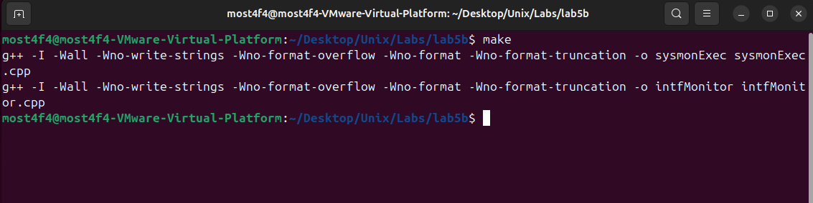
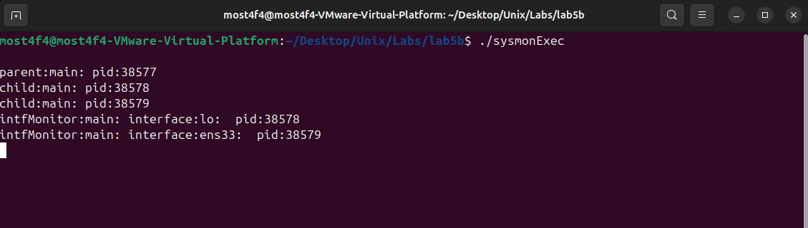
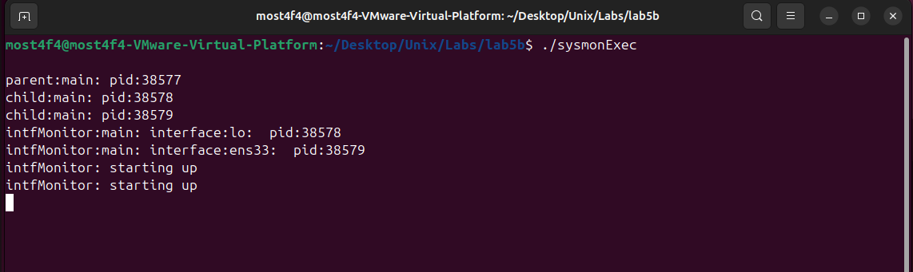
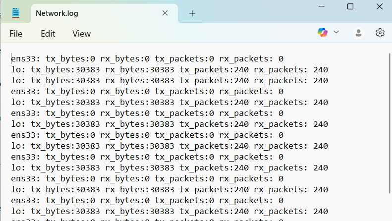
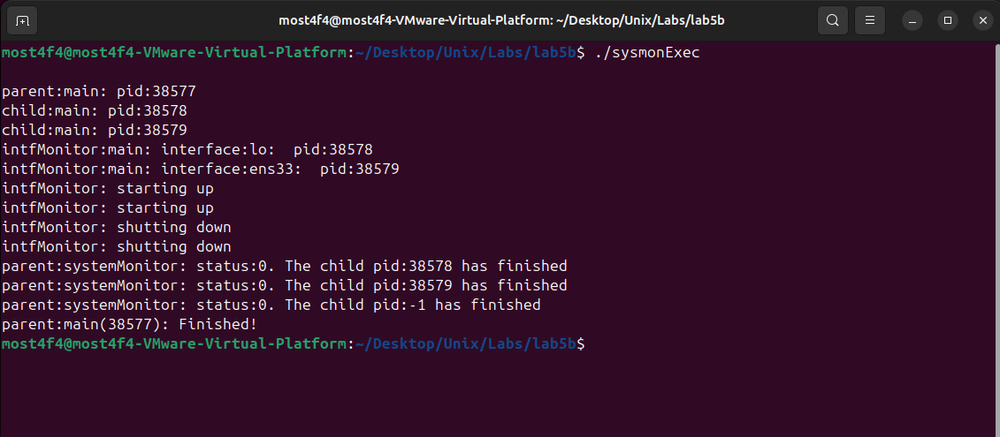

# Signal-Based System Monitor - Advanced Process Control & IPC

## Overview

This project implements a **signal-driven system monitoring architecture** using **Unix signals for inter-process communication**, **fork/exec process management**, and **real-time network interface monitoring**. The system demonstrates advanced **process coordination**, **signal handling**, **file I/O operations**, and **parent-child process synchronization** in a Unix/Linux environment.

## Key Features

- **Signal-Based IPC**: SIGUSR1, SIGUSR2 for process start/stop control
- **Process Management**: Fork/exec pattern for child process creation
- **Signal Masking**: Advanced signal handling with sigaction and signal blocking
- **Network Monitoring**: Real-time interface statistics from `/sys/class/net/`
- **File I/O Logging**: Persistent data storage with file descriptor management
- **Signal Interception**: SIGINT and SIGTSTP handling with custom responses
- **Process Synchronization**: Parent-child coordination using signals
- **Resource Management**: Proper cleanup and process termination handling

## System Architecture

### Process Control Hierarchy

```
                    ┌─────────────────────────────┐
                    │      PARENT PROCESS         │
                    │      (sysmonExec)           │
                    │                             │
                    │ • Process Creation          │
                    │ • Signal Management         │
                    │ • Child Coordination        │
                    │ • Lifecycle Control         │
                    └──────────────┬──────────────┘
                                   │
                         ┌─────────┴─────────┐
                         │     fork()        │
                         └─────────┬─────────┘
                                   │
        ┌──────────────────────────┼──────────────────────────┐
        ▼                          ▼                          ▼
┌─────────────────┐      ┌─────────────────┐      ┌─────────────────┐
│Interface Monitor│      │Interface Monitor│      │Interface Monitor│
│   (Child 1)     │      │   (Child 2)     │      │   (Child N)     │
│                 │      │                 │      │                 │
│ • Monitor lo    │      │ • Monitor ens33 │      │ • Monitor wlan0 │
│ • Signal Handler│      │ • Signal Handler│      │ • Signal Handler│
│ • File Logging  │      │ • File Logging  │      │ • File Logging  │
│ • Stats Polling │      │ • Stats Polling │      │ • Stats Polling │
└─────────────────┘      └─────────────────┘      └─────────────────┘
```

### Signal Communication Protocol

```
Signal-Based IPC Protocol:
┌─────────────────────────────────────────────────────────────────────┐
│ SIGUSR1 → Parent to Child: "Start Monitoring" (sent after 10 sec)   │
│ SIGUSR2 → Parent to Child: "Stop Monitoring" (sent after 30 sec)    │
│ SIGINT  → External: Intercepted and discarded (manual testing)      │
│ SIGTSTP → External: Intercepted and discarded (manual testing)      │
└─────────────────────────────────────────────────────────────────────┘

Program Timeline:
┌─────────────────────────────────────────────────────────────────────┐
│ T0     : Parent forks children, children initialize                 │
│ T0-10  : Children wait in pause() for SIGUSR1 signal               │
│ T10    : Parent sends SIGUSR1 → Children start monitoring           │
│ T10-40 : Children poll network stats every second (30 seconds)      │
│ T40    : Parent sends SIGUSR2 → Children stop monitoring            │
│ T40+   : Parent waits for children to terminate                     │
└─────────────────────────────────────────────────────────────────────┘
```

## Technical Implementation

### Signal Handler Configuration

```cpp
// Advanced signal handling with sigaction
struct sigaction action;
action.sa_handler = signalHandler;
sigemptyset(&action.sa_mask);
action.sa_flags = SA_RESTART;

// Block signals during handler execution
sigaddset(&action.sa_mask, SIGINT);
sigaddset(&action.sa_mask, SIGTSTP);

// Register handlers for multiple signals
sigaction(SIGUSR1, &action, NULL);  // Start signal
sigaction(SIGUSR2, &action, NULL);  // Stop signal
sigaction(SIGINT, &action, NULL);   // Ctrl+C interception
sigaction(SIGTSTP, &action, NULL);  // Ctrl+Z interception
```

### Signal Handler Implementation

```cpp
static void signalHandler(int signum) {
    switch (signum) {
        case SIGUSR1:
            cout << "intfMonitor: starting up" << endl;
            isRunning = true;
            break;
        case SIGUSR2:
            cout << "intfMonitor: shutting down" << endl;
            isRunning = false;
            break;
        case SIGINT:
            cout << "intfMonitor: ctrl-C discarded" << endl;
            // Signal discarded - no action taken
            break;
        case SIGTSTP:
            cout << "intfMonitor: ctrl-Z discarded" << endl;
            // Signal discarded - no action taken
            break;
        default:
            cout << "intfMonitor: undefined signal" << endl;
            break;
    }
}
```

### Process Creation and Management

```cpp
// Fork/exec pattern for child process creation
for(int i = 0; i < NUM && isParent; ++i) {
    childPid[i] = fork();

    if(childPid[i] == 0) {  // Child process
        cout << "child:main: pid:" << getpid() << endl;
        isParent = false;

        // Replace process image with interface monitor
        execlp("./intfMonitor", "./intfMonitor", intf[i], NULL);

        // Should never reach here
        cout << "child:main: exec failed!" << endl;
        cout << strerror(errno) << endl;
    }
}
```

### Network Statistics Collection

```cpp
// Real-time network interface monitoring
while(isRunning) {
    int tx_bytes = 0, rx_bytes = 0;
    int tx_packets = 0, rx_packets = 0;

    // Read statistics from /sys/class/net/
    sprintf(statPath, "/sys/class/net/%s/statistics/tx_bytes", interface);
    ifstream infile(statPath);
    if(infile.is_open()) {
        infile >> tx_bytes;
        infile.close();
    }

    // Log data to file
    char data[MAXBUF];
    int len = sprintf(data, "%s: tx_bytes:%d rx_bytes:%d tx_packets:%d rx_packets:%d\n",
                     interface, tx_bytes, rx_bytes, tx_packets, rx_packets);
    write(fd, data, len);

    sleep(1);  // Poll every second
}
```

### Process Control and Synchronization

```cpp
// Parent process coordination
int systemMonitor() {
    // Send start signals to all children
    for (size_t i = 0; i < NUM; ++i) {
        kill(childPid[i], SIGUSR1);
    }

    sleep(30);  // Monitor for 30 seconds

    // Send stop signals to all children
    for (size_t i = 0; i < NUM; ++i) {
        kill(childPid[i], SIGUSR2);
    }

    // Wait for all children to terminate
    int status = -1;
    pid_t pid = 0;
    while(pid >= 0) {
        pid = wait(&status);  // Blocking wait
        cout << "parent: child pid:" << pid << " finished" << endl;
    }

    return 0;
}
```

## Build and Run Instructions

### Prerequisites

- **Operating System**: Linux/Unix with `/sys/class/net/` filesystem support
- **Compiler**: g++ with C++11 support
- **Network Interfaces**: At least two interfaces (e.g., `lo`, `ens33`)
- **Permissions**: User-level access (no root required for monitoring)

### File Structure Setup

Create the following files in your project directory:

```
├── Makefile              # Build configuration
├── sysmonExec.cpp        # Parent process (main system monitor)
├── intfMonitor.cpp       # Child process (interface monitor)
├── Network.log          # Generated log file (created at runtime)
└── README.md            # Project documentation
```

### Compilation

```bash
# Build both executables
make all

# Build individual components
make sysmonExec
make intfMonitor

# Clean build artifacts
make clean
```



_Successful compilation of system monitor components_

### Execution Workflow

#### Step 1: Run System Monitor

```bash
./sysmonExec
```

**Expected Output:**

```
parent:main: pid:38577

child:main: pid:38578
child:main: pid:38579
intfMonitor:main: interface:lo:  pid:12345
intfMonitor:main: interface:ens33:  pid:12345
```


_Parent and child process initialization with interface assignment_

#### Step 2: Signal Processing (After 10 seconds)

The parent automatically sends SIGUSR1 to start monitoring:

```
intfMonitor: starting up
intfMonitor: starting up
```



_SIGUSR1 signal sent to start monitoring after 10-second delay_

#### Step 3: Monitoring Phase (30 seconds)

**Network.log Content (Real Output):**

```
lo: tx_bytes:30383 rx_bytes:30383 tx_packets:240 rx_packets:240
ens33: tx_bytes:0 rx_bytes:0 tx_packets:0 rx_packets:0
lo: tx_bytes:30383 rx_bytes:30383 tx_packets:240 rx_packets:240
ens33: tx_bytes:0 rx_bytes:0 tx_packets:0 rx_packets:0
...
```



_Real-time network statistics being logged to Network.log_

#### Step 4: Automatic Shutdown (After 30 seconds)

The parent automatically sends SIGUSR2 to stop monitoring:

```
intfMonitor: shutting down
intfMonitor: shutting down
parent:systemMonitor: status:0. The child pid:38578 has finished
parent:systemMonitor: status:0. The child pid:38579 has finished
parent:systemMonitor: status:0. The child pid:-1 has finished
parent:main(38577): Finished!
```



_Clean termination of all processes after 30 seconds of monitoring_

## Advanced Signal Handling Concepts

### Signal Masking and Blocking

```cpp
// Block specific signals during critical sections
sigset_t block_set;
sigemptyset(&block_set);
sigaddset(&block_set, SIGINT);
sigaddset(&block_set, SIGTSTP);

// Block signals temporarily
sigprocmask(SIG_BLOCK, &block_set, NULL);

// ... critical code section ...

// Unblock signals
sigprocmask(SIG_UNBLOCK, &block_set, NULL);
```

### Signal Safety and Async-Signal-Safe Functions

```cpp
// Only async-signal-safe functions should be used in signal handlers
static void signalHandler(int signum) {
    // SAFE: write() is async-signal-safe
    const char msg[] = "Signal received\n";
    write(STDERR_FILENO, msg, sizeof(msg) - 1);

    // UNSAFE: cout, printf are not async-signal-safe
    // cout << "Signal received" << endl;  // DON'T DO THIS

    // Set flags instead
    volatile sig_atomic_t signal_flag = 1;
}
```

### Process Group Signal Management

```cpp
// Send signal to process group
pid_t pgid = getpgrp();
killpg(pgid, SIGUSR1);  // Send to all processes in group

// Create new process group
setpgid(0, 0);  // Make current process group leader
```

## Performance Analysis

### Resource Utilization

```
System Resource Usage:
┌─────────────────────────────────────────────────────────────────┐
│ Parent Process (sysmonExec):                                    │
│   Memory: ~1-2 MB                                               │
│   CPU: <0.1% (mostly sleeping)                                  │
│   File Descriptors: 3 (stdin, stdout, stderr)                   │
├─────────────────────────────────────────────────────────────────┤
│ Child Process (intfMonitor) × 2:                                │
│   Memory: ~1-2 MB each                                          │
│   CPU: ~0.1% each (1-second polling)                            │
│   File Descriptors: 4 each (stdio + log file)                   │
├─────────────────────────────────────────────────────────────────┤
│ Total System Impact:                                            │
│   Memory: ~4-6 MB total                                         │
│   CPU: ~0.3% total                                              │
│   Disk I/O: ~20 bytes/second (log writing)                      │
└─────────────────────────────────────────────────────────────────┘
```

### Signal Latency Measurements

```bash
# Measure signal delivery time
time kill -SIGUSR1 <pid>

# Typical latencies:
# SIGUSR1/SIGUSR2: ~1-10 microseconds
# Process termination: ~1-100 milliseconds
# File I/O operations: ~100-1000 microseconds
```

## Testing and Validation

### Signal Handler Testing

```bash
# Test script for comprehensive signal validation
#!/bin/bash

echo "Starting system monitor..."
./sysmonExec &
PARENT_PID=$!

sleep 12  # Wait for children to start

# Find child PIDs
CHILD_PIDS=$(pgrep -P $PARENT_PID intfMonitor)

echo "Testing signal interception..."
for pid in $CHILD_PIDS; do
    echo "Sending SIGINT to PID $pid"
    kill -SIGINT $pid
    sleep 1

    echo "Sending SIGTSTP to PID $pid"
    kill -SIGTSTP $pid
    sleep 1
done

# Wait for normal completion
wait $PARENT_PID
echo "Test completed"
```

### Log File Analysis

```bash
# Analyze network log patterns
awk '{print $1, $2}' Network.log | sort | uniq -c

# Check for data consistency
grep "lo:" Network.log | wc -l
grep "ens33:" Network.log | wc -l

# Monitor file size growth
watch -n 1 'ls -lh Network.log'
```

## Educational Objectives

### Signal Processing Concepts

1. **Signal Types**: Understanding POSIX signals and their purposes
2. **Signal Handlers**: Implementing custom signal processing functions
3. **Signal Masking**: Controlling signal delivery timing
4. **Async-Signal-Safety**: Writing safe signal handlers

### Process Management

1. **Fork/Exec Pattern**: Creating and replacing process images
2. **Process Groups**: Managing related processes together
3. **Parent-Child Communication**: IPC via signals
4. **Process Synchronization**: Coordinating multiple processes

### System Programming

1. **File I/O Operations**: Low-level file descriptor management
2. **Error Handling**: Robust system call error checking
3. **Resource Management**: Proper cleanup and leak prevention
4. **System Statistics**: Reading from virtual filesystems

## Troubleshooting

### Common Issues

1. **Executable Not Found**

   ```bash
   # Ensure intfMonitor is compiled and in current directory
   ls -la intfMonitor
   chmod +x intfMonitor
   ```

2. **Permission Denied for Network Stats**

   ```bash
   # Check /sys/class/net/ access
   ls -la /sys/class/net/
   cat /sys/class/net/lo/statistics/tx_bytes
   ```

3. **Signal Not Delivered**

   ```bash
   # Check process is still running
   ps aux | grep intfMonitor

   # Verify signal handler registration
   strace -e trace=rt_sigaction ./intfMonitor lo
   ```

4. **Log File Not Created**

   ```bash
   # Check current directory permissions
   touch test.log && rm test.log

   # Verify file descriptor usage
   lsof +p $(pgrep intfMonitor)
   ```

### Debug Mode Implementation

```cpp
#ifdef DEBUG
    cout << "[DEBUG] Signal " << signum << " received by PID " << getpid() << endl;
    cout << "[DEBUG] isRunning state: " << (isRunning ? "true" : "false") << endl;
    cout << "[DEBUG] Interface: " << interface << endl;
#endif
```

Compile with debugging:

```bash
g++ -DDEBUG -Wall -g -o intfMonitor intfMonitor.cpp
```

## Extensions and Enhancements

### Real-Time Signal Usage

```cpp
// Use real-time signals for extended functionality
#include <signal.h>

// Send data with signal
union sigval data;
data.sival_int = interface_id;
sigqueue(child_pid, SIGRTMIN, data);

// Receive data in handler
void rt_handler(int sig, siginfo_t *info, void *context) {
    int interface_id = info->si_value.sival_int;
    cout << "Real-time signal for interface " << interface_id << endl;
}
```

### Signal-Based Configuration Updates

```cpp
// Dynamic configuration updates via signals
void config_handler(int signum) {
    switch(signum) {
        case SIGUSR1:
            polling_interval = 1;  // Fast polling
            break;
        case SIGUSR2:
            polling_interval = 5;  // Slow polling
            break;
    }
}
```

### Process Pool Management

```cpp
// Dynamic process creation based on available interfaces
vector<string> available_interfaces = scan_network_interfaces();
vector<pid_t> monitor_processes;

for(const string& intf : available_interfaces) {
    pid_t pid = fork();
    if(pid == 0) {
        execlp("./intfMonitor", "./intfMonitor", intf.c_str(), NULL);
    } else {
        monitor_processes.push_back(pid);
    }
}
```

## Real-World Applications

### System Administration

- **Service Management**: Start/stop system services via signals
- **Log Rotation**: Signal-triggered log file rotation
- **Configuration Reload**: Dynamic configuration updates
- **Health Monitoring**: Process health checks and recovery

### Network Operations

- **Interface Monitoring**: Real-time network performance tracking
- **Traffic Analysis**: Bandwidth utilization monitoring
- **Fault Detection**: Automatic detection of network issues
- **Performance Optimization**: Dynamic resource allocation

### Process Control Systems

- **Industrial Automation**: Signal-based control systems
- **Embedded Systems**: Resource-constrained process communication
- **Real-Time Systems**: Deterministic signal processing
- **Distributed Systems**: Coordinated process management

## Dependencies

- **Compiler**: g++ with C++11 support
- **System Libraries**:
  - `signal.h` (signal handling)
  - `sys/wait.h` (process management)
  - `unistd.h` (POSIX functions)
  - `fcntl.h` (file operations)
- **Operating System**: Linux/Unix with signal support and `/sys/class/net/`
- **Network Interfaces**: At least one active network interface

## File Structure

```
├── Makefile                 # Build configuration
├── README.md               # Project documentation
├── sysmonExec.cpp          # Parent process (system monitor)
├── intfMonitor.cpp         # Child process (interface monitor)
├── Network.log            # Generated log file (runtime)
└── screenshots/           # Documentation images
    ├── make_build.png
    ├── process_startup.png
    ├── process_sendingSignal.png
    ├── network_log.png
    └── graceful_shutdown.png
```

## License

This program is for educational purposes and is free to use and modify.

## Author

**Mostafa Hasanalipourshahrabadi**

- Advanced Unix signal processing and IPC concepts
- Process management and coordination systems
- System programming and network monitoring
- Tested and validated on Linux VM environments

---

_This project demonstrates enterprise-level signal processing and process management concepts with practical implementation of Unix IPC mechanisms - essential knowledge for system programming and process control systems._
