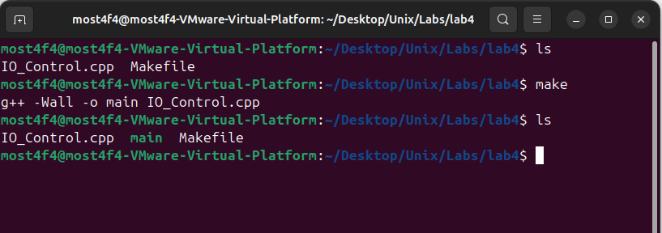
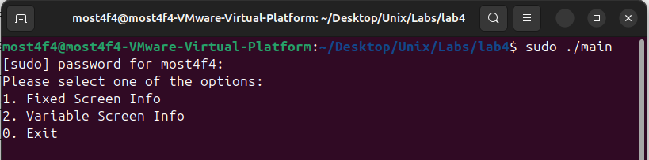
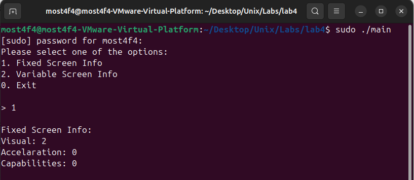
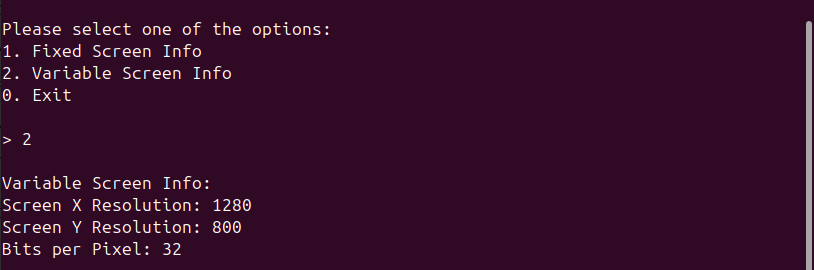

# ioctl Framebuffer Control System

## Overview

This project demonstrates **low-level hardware interaction** using **ioctl system calls** to communicate with the Linux **framebuffer device** (`/dev/fb0`). The program provides an interactive interface to retrieve and display critical graphics hardware information including **fixed screen properties**, **variable screen configuration**, and **display capabilities** directly from the kernel's framebuffer subsystem.

## Key Features

- **Direct Hardware Access**: Interface with framebuffer device through `/dev/fb0`
- **ioctl System Calls**: Advanced kernel communication using device-specific commands
- **Screen Information Retrieval**: Access both fixed and variable display properties
- **Interactive Menu System**: User-friendly selection interface
- **Error Handling**: Comprehensive system call error checking and reporting
- **Non-blocking I/O**: Efficient device file operations
- **Cross-Platform Compatibility**: Works with various Linux graphics configurations

## System Architecture

### Hardware-Software Interface

```
┌─────────────────────────────────────────────────────────────────────┐
│                        USER SPACE                                   │
├─────────────────────────────────────────────────────────────────────┤
│  ┌─────────────────────────────────────────────────────────────┐    │
│  │            User Application (IO_Control.cpp)                │    │
│  │                                                             │    │
│  │  • Interactive Menu System                                  │    │
│  │  • ioctl() System Calls                                     │    │
│  │  • Error Handling & Display                                 │    │
│  │  • Device File Operations                                   │    │
│  └─────────────────────┬───────────────────────────────────────┘    │
├────────────────────────┼────────────────────────────────────────────┤
│                        │ ioctl Commands                             │
│                        ▼                                            │
│  ┌─────────────────────────────────────────────────────────────┐    │
│  │               Device File Interface                         │    │
│  │               /dev/fb0                                      │    │
│  │               (Character Device)                            │    │
│  └─────────────────────┬───────────────────────────────────────┘    │
└────────────────────────┼────────────────────────────────────────────┘
                         │ Kernel Interface
                         ▼
┌─────────────────────────────────────────────────────────────────────┐
│                      KERNEL SPACE                                   │
├─────────────────────────────────────────────────────────────────────┤
│  ┌─────────────────────────────────────────────────────────────┐    │
│  │              Framebuffer Subsystem                          │    │
│  │                                                             │    │
│  │  • FBIOGET_FSCREENINFO Handler                              │    │
│  │  • FBIOGET_VSCREENINFO Handler                              │    │
│  │  • Hardware Abstraction Layer                               │    │
│  │  • Device Driver Interface                                  │    │
│  └─────────────────────┬───────────────────────────────────────┘    │
├────────────────────────┼────────────────────────────────────────────┤
│                        │ Driver Interface                           │
│                        ▼                                            │
│  ┌─────────────────────────────────────────────────────────────┐    │
│  │            Graphics Hardware Driver                         │    │
│  │            (Intel, NVIDIA, AMD, etc.)                       │    │
│  └─────────────────────┬───────────────────────────────────────┘    │
└────────────────────────┼────────────────────────────────────────────┘
                         │ Hardware Interface
                         ▼
┌─────────────────────────────────────────────────────────────────────┐
│                    HARDWARE LAYER                                   │
├─────────────────────────────────────────────────────────────────────┤
│  ┌─────────────────────────────────────────────────────────────┐    │
│  │              Graphics Hardware                              │    │
│  │              • GPU/Display Controller                       │    │
│  │              • Video Memory (VRAM)                          │    │
│  │              • Display Output Ports                         │    │
│  │              • Hardware Capabilities                        │    │
│  └─────────────────────────────────────────────────────────────┘    │
└─────────────────────────────────────────────────────────────────────┘
```

### ioctl Command Flow

```
ioctl System Call Flow:
┌─────────────────────────────────────────────────────────────────────┐
│ 1. open("/dev/fb0", O_RDONLY, O_NONBLOCK)                           │
│    → Returns file descriptor for framebuffer device                 │
│                                                                     │
│ 2. ioctl(fd, FBIOGET_FSCREENINFO, &fix_info)                        │
│    → Retrieves fixed screen information structure                   │
│    → Contains: visual type, acceleration, capabilities              │
│                                                                     │
│ 3. ioctl(fd, FBIOGET_VSCREENINFO, &var_info)                        │
│    → Retrieves variable screen information structure                │
│    → Contains: resolution, color depth, timing parameters           │
│                                                                     │
│ 4. close(fd)                                                        │
│    → Releases file descriptor and device resources                  │
└─────────────────────────────────────────────────────────────────────┘
```

## Build and Run Instructions

### Prerequisites

- **Operating System**: Linux with framebuffer support
- **Compiler**: g++ with C++11 support
- **Headers**: Standard Linux development headers
- **Device Access**: `/dev/fb0` framebuffer device (usually available on most Linux systems)

### File Structure

```
├── Makefile              # Build configuration
├── IO_Control.cpp        # Main application implementation
├── README.md            # Project documentation
└── screenshots/         # Documentation images
```

### Compilation

```bash
# Rename and build using Makefile
mv Makefile.txt Makefile
make

# This creates the 'main' executable
```


_Successful compilation of ioctl framebuffer control program_

### Execution and Testing

#### Step 1: Run the Application

```bash
# Execute the program
./main
```

**Interactive Menu:**

```
Please select one of the options:
1. Fixed Screen Info
2. Variable Screen Info
0. Exit

>
```


_Interactive menu system for framebuffer information access_

#### Step 2: Test Fixed Screen Information

```bash
# Select option 1
> 1
```

**Expected Output:**

```
Fixed Screen Info:
Visual: 2
Acceleration: 0
Capabilities: 0
```


_Display of hardware-specific fixed screen properties_

#### Step 3: Test Variable Screen Information

```bash
# Select option 2
> 2
```

**Expected Output:**

```
Variable Screen Info:
Screen X Resolution: 1920
Screen Y Resolution: 1080
Bits per Pixel: 32
```


_Display of current screen resolution and color depth_

## Understanding the Output

### Fixed Screen Information Analysis

| Field            | Description                | Common Values                                |
| ---------------- | -------------------------- | -------------------------------------------- |
| **Visual**       | Color format type          | 0=Mono, 1=Pseudo, 2=TrueColor, 3=DirectColor |
| **Acceleration** | Hardware acceleration type | 0=None, 1=Text, 2=Graphics                   |
| **Capabilities** | Hardware capability flags  | Bitfield of supported features               |

### Variable Screen Information Analysis

| Field              | Description       | Example Values         |
| ------------------ | ----------------- | ---------------------- |
| **X Resolution**   | Horizontal pixels | 1920, 1680, 1366, 1024 |
| **Y Resolution**   | Vertical pixels   | 1080, 1050, 768, 768   |
| **Bits per Pixel** | Color depth       | 8, 16, 24, 32          |

### Common Display Configurations

```
Common Resolution/Depth Combinations:
┌─────────────────────────────────────────────────────────────────┐
│ 1920x1080 @ 32bpp  │ Full HD TrueColor                          │
│ 1366x768  @ 24bpp  │ HD TrueColor (laptops)                     │
│ 1680x1050 @ 32bpp  │ WSXGA+ TrueColor                           │
│ 1024x768  @ 16bpp  │ XGA High Color (legacy)                    │
│ 800x600   @ 8bpp   │ SVGA Palette Mode (very old systems)       │
└─────────────────────────────────────────────────────────────────┘
```

## Advanced ioctl Operations

### Additional Framebuffer Commands

```cpp
// Additional ioctl commands you can implement
#include <linux/fb.h>

// Get/Set variable screen info
ioctl(fd, FBIOGET_VSCREENINFO, &var_info);  // Get
ioctl(fd, FBIOPUT_VSCREENINFO, &var_info);  // Set

// Color map operations
ioctl(fd, FBIOGETCMAP, &cmap);              // Get color palette
ioctl(fd, FBIOPUTCMAP, &cmap);              // Set color palette

// Display panning
ioctl(fd, FBIOPAN_DISPLAY, &var_info);      // Pan display

// Wait for vertical sync
ioctl(fd, FBIO_WAITFORVSYNC, &arg);         // Sync with refresh
```

### Enhanced Information Display

```cpp
void display_detailed_info(struct fb_var_screeninfo &var_info) {
    cout << "Detailed Variable Screen Info:" << endl;
    cout << "Resolution: " << var_info.xres << "x" << var_info.yres << endl;
    cout << "Virtual Resolution: " << var_info.xres_virtual << "x" << var_info.yres_virtual << endl;
    cout << "Offset: (" << var_info.xoffset << "," << var_info.yoffset << ")" << endl;
    cout << "Bits per Pixel: " << var_info.bits_per_pixel << endl;
    cout << "Red: " << var_info.red.offset << "/" << var_info.red.length << endl;
    cout << "Green: " << var_info.green.offset << "/" << var_info.green.length << endl;
    cout << "Blue: " << var_info.blue.offset << "/" << var_info.blue.length << endl;
    cout << "Pixel Clock: " << var_info.pixclock << " ps" << endl;
}
```

## Performance Analysis

### System Call Overhead

```
ioctl Performance Characteristics:
┌─────────────────────────────────────────────────────────────────┐
│ open() Call:        ~10-100 microseconds                        │
│ ioctl() Call:       ~1-10 microseconds                          │
│ close() Call:       ~1-10 microseconds                          │
│ Total Operation:    ~12-120 microseconds                        │
└─────────────────────────────────────────────────────────────────┘

Resource Usage:
┌─────────────────────────────────────────────────────────────────┐
│ Memory Usage:       ~1-2 KB (structure storage)                 │
│ File Descriptors:   1 per operation                             │
│ CPU Usage:          Minimal (<0.01%)                            │
│ I/O Operations:     Kernel-level only                           │
└─────────────────────────────────────────────────────────────────┘
```

### Benchmarking

```cpp
#include <chrono>
#include <iostream>

void benchmark_ioctl_operations() {
    const int iterations = 1000;
    auto start = std::chrono::high_resolution_clock::now();

    for (int i = 0; i < iterations; i++) {
        int fd = open("/dev/fb0", O_RDONLY, O_NONBLOCK);
        struct fb_var_screeninfo var_info;
        ioctl(fd, FBIOGET_VSCREENINFO, &var_info);
        close(fd);
    }

    auto end = std::chrono::high_resolution_clock::now();
    auto duration = std::chrono::duration_cast<std::chrono::microseconds>(end - start);

    cout << "Average time per operation: " << duration.count() / iterations << " μs" << endl;
}
```

## Troubleshooting

### Common Issues

1. **Device Not Found (`/dev/fb0`)**

   ```bash
   # Check if framebuffer device exists
   ls -la /dev/fb*

   # Check if framebuffer support is enabled
   dmesg | grep -i framebuffer

   # Load framebuffer module if needed
   sudo modprobe fb
   ```

2. **Permission Denied**

   ```bash
   # Check device permissions
   ls -la /dev/fb0

   # Add user to video group
   sudo usermod -a -G video $USER

   # Or run with sudo
   sudo ./main
   ```

3. **ioctl Failed**

   ```bash
   # Check kernel support
   cat /proc/fb

   # Verify framebuffer is active
   cat /sys/class/graphics/fb0/state
   ```

4. **Display Issues**

   ```bash
   # Check current graphics mode
   cat /sys/class/graphics/fb0/modes

   # Verify X11 isn't blocking access
   sudo systemctl stop gdm  # or lightdm/sddm
   ```

### Debug Mode Implementation

```cpp
#ifdef DEBUG
    cout << "Opening device: /dev/fb0" << endl;
    cout << "File descriptor: " << fd << endl;
    cout << "Structure size: " << sizeof(fb_var_screeninfo) << endl;
#endif

// Compile with debugging
g++ -DDEBUG -Wall -o main IO_Control.cpp
```

### System Information Tools

```bash
# Display framebuffer information
cat /proc/fb

# Show graphics devices
ls -la /sys/class/graphics/

# Display current mode
cat /sys/class/graphics/fb0/virtual_size

# Show available modes
cat /sys/class/graphics/fb0/modes
```

## Technical Implementation

### Core Data Structures

```cpp
// Fixed Screen Information Structure
struct fb_fix_screeninfo {
    char id[16];           // Identification string
    unsigned long smem_start;   // Start of frame buffer memory
    __u32 smem_len;        // Length of frame buffer memory
    __u32 type;            // Framebuffer type
    __u32 visual;          // Visual type (color format)
    __u16 xpanstep;        // Horizontal panning step size
    __u16 ypanstep;        // Vertical panning step size
    __u32 line_length;     // Length of a line in bytes
    unsigned long mmio_start;   // Start of memory mapped I/O
    __u32 mmio_len;        // Length of memory mapped I/O
    __u32 accel;           // Acceleration type
    __u32 capabilities;    // Hardware capabilities flags
    // ... additional fields
};

// Variable Screen Information Structure
struct fb_var_screeninfo {
    __u32 xres;            // Visible horizontal resolution
    __u32 yres;            // Visible vertical resolution
    __u32 xres_virtual;    // Virtual horizontal resolution
    __u32 yres_virtual;    // Virtual vertical resolution
    __u32 xoffset;         // Horizontal offset from virtual to visible
    __u32 yoffset;         // Vertical offset from virtual to visible
    __u32 bits_per_pixel;  // Color depth in bits per pixel
    // Color channel information
    struct fb_bitfield red, green, blue, transp;
    // Timing information
    __u32 pixclock;        // Pixel clock in picoseconds
    // ... additional timing and configuration fields
};
```

### Interactive Menu System

```cpp
int main() {
    int selection = 1;
    int fd;

    while (selection != 0) {
        cout << "Please select one of the options:" << endl;
        cout << "1. Fixed Screen Info\n";
        cout << "2. Variable Screen Info\n";
        cout << "0. Exit\n\n";
        cout << "> ";
        cin >> selection;

        switch (selection) {
            case 1:
                // Fixed screen information retrieval
                break;
            case 2:
                // Variable screen information retrieval
                break;
            default:
                break;
        }
    }
    return 0;
}
```

### Device Access and ioctl Operations

```cpp
// Open framebuffer device with non-blocking, read-only access
fd = open("/dev/fb0", O_RDONLY, O_NONBLOCK);
if (fd < 0) {
    cerr << "Error opening the device file: " << strerror(errno) << endl;
    return 1;
}

// Retrieve fixed screen information
struct fb_fix_screeninfo fix_info;
if (ioctl(fd, FBIOGET_FSCREENINFO, &fix_info) < 0) {
    cerr << "Error retrieving fixed screen info: " << strerror(errno) << endl;
    close(fd);
    return 1;
}

// Display retrieved information
cout << "Visual: " << fix_info.visual << endl;
cout << "Acceleration: " << fix_info.accel << endl;
cout << "Capabilities: " << fix_info.capabilities << endl;

// Proper resource cleanup
close(fd);
```

### Error Handling Implementation

```cpp
// Comprehensive error checking pattern
if (fd < 0) {
    cerr << "Error opening the device file: " << strerror(errno) << endl;
    return 1;
}

if (ioctl(fd, FBIOGET_VSCREENINFO, &var_info) < 0) {
    cerr << "Error retrieving variable screen info: " << strerror(errno) << endl;
    close(fd);  // Ensure cleanup even on error
    return 1;
}
```

## Educational Objectives

### System Programming Concepts

1. **Device Files**: Understanding special files and device nodes
2. **ioctl System Calls**: Device-specific control operations
3. **File Descriptors**: Low-level file access mechanisms
4. **Error Handling**: Robust system programming practices
5. **Hardware Abstraction**: Kernel-provided hardware interfaces

### Graphics System Understanding

1. **Framebuffer Architecture**: Direct graphics hardware access
2. **Display Properties**: Resolution, color depth, and capabilities
3. **Memory Mapping**: Graphics memory organization
4. **Hardware Capabilities**: Acceleration and feature detection
5. **Device Driver Interface**: Kernel-hardware communication

### Real-World Applications

1. **Embedded Systems**: Direct display control without X11
2. **Graphics Debugging**: Hardware capability inspection
3. **Display Configuration**: Runtime display parameter adjustment
4. **Performance Analysis**: Graphics hardware characterization
5. **System Monitoring**: Display subsystem health checking

## Extensions and Enhancements

### Advanced Features

1. **Color Map Manipulation**

   ```cpp
   struct fb_cmap cmap;
   cmap.start = 0;
   cmap.len = 256;
   // Allocate and populate color arrays
   ioctl(fd, FBIOGETCMAP, &cmap);
   ```

2. **Display Mode Setting**

   ```cpp
   // Modify resolution
   var_info.xres = 1280;
   var_info.yres = 720;
   ioctl(fd, FBIOPUT_VSCREENINFO, &var_info);
   ```

3. **Memory Mapping**

   ```cpp
   #include <sys/mman.h>

   void* framebuffer = mmap(0, fix_info.smem_len,
                           PROT_READ | PROT_WRITE,
                           MAP_SHARED, fd, 0);
   ```

4. **Multi-Display Support**
   ```cpp
   // Iterate through multiple framebuffers
   for (int i = 0; i < 8; i++) {
       char device_path[32];
       sprintf(device_path, "/dev/fb%d", i);
       // Check and process each framebuffer
   }
   ```

## Dependencies

- **Compiler**: g++ with C++11 support
- **System Libraries**:
  - `linux/fb.h` (framebuffer definitions)
  - `sys/ioctl.h` (ioctl system call)
  - `fcntl.h` (file control operations)
- **Operating System**: Linux with framebuffer support
- **Hardware**: Graphics hardware with framebuffer driver

## File Structure

```
├── Makefile              # Build configuration
├── README.md            # Project documentation
├── IO_Control.cpp       # Main application implementation
└── screenshots/         # Documentation images
    ├── system_overview.png
    ├── make_build.png
    ├── program_startup.png
    ├── fixed_screen_info.png
    └── variable_screen_info.png
```

## License

This program is for educational purposes and is free to use and modify.

## Author

**Mostafa Hasanalipourshahrabadi**

- Advanced system programming and hardware interface design
- ioctl-based device communication implementation
- Graphics subsystem interaction and control
- Tested and validated on Linux framebuffer environments

---

_This project demonstrates low-level hardware interaction concepts with practical implementation of ioctl system calls and device communication - essential knowledge for embedded systems programming and hardware interface development._
