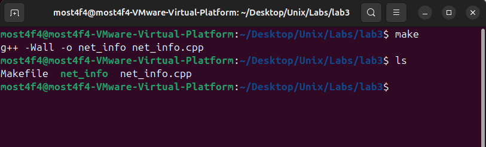
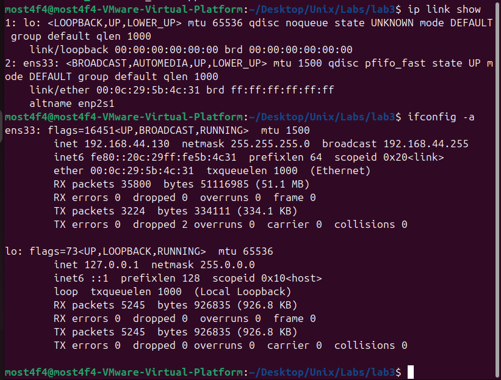
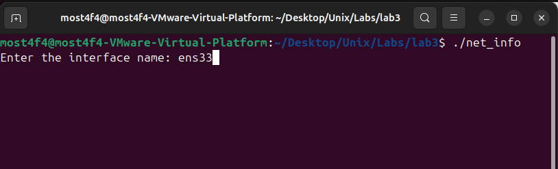
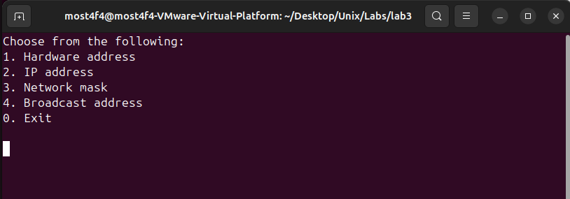
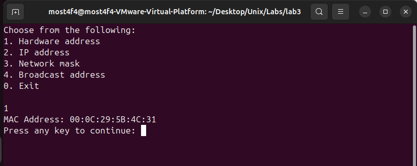
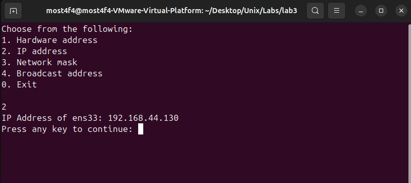
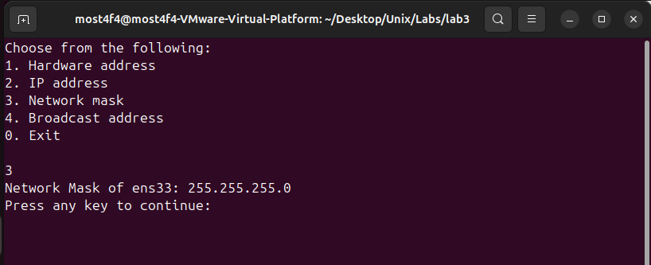
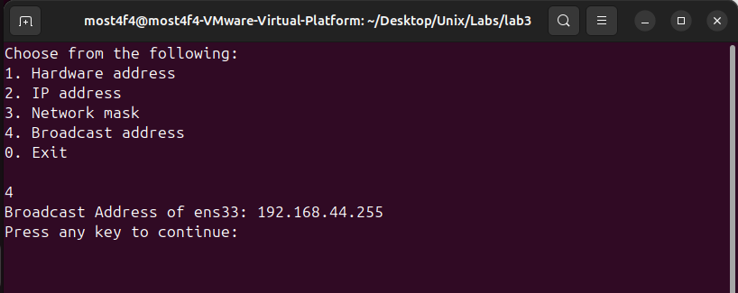

# Network Interface Information Retrieval System

## Overview

This project implements a **comprehensive network interface inspection tool** using **ioctl system calls** and **socket-based communication** to retrieve detailed network configuration information directly from the Linux kernel. The program demonstrates advanced **network programming**, **system-level device interaction**, and **kernel interface communication** for real-time network interface analysis.

## Key Features

- **Direct Kernel Communication**: Interface with network subsystem via ioctl system calls
- **Socket-Based Implementation**: UDP socket for network interface queries
- **Comprehensive Interface Information**: MAC address, IP address, netmask, and broadcast address
- **Interactive Menu System**: User-friendly interface selection and information display
- **Cross-Interface Compatibility**: Works with Ethernet, Wi-Fi, and virtual interfaces
- **Real-Time Data Retrieval**: Live network configuration information
- **Error Handling**: Robust system call error checking and reporting
- **Interface Validation**: Ethernet interface type verification

## System Architecture

### Network Information Retrieval Flow

```
┌─────────────────────────────────────────────────────────────────────┐
│                        USER SPACE                                   │
├─────────────────────────────────────────────────────────────────────┤
│  ┌─────────────────────────────────────────────────────────────┐    │
│  │         User Application (net_info.cpp)                     │    │
│  │                                                             │    │
│  │  • Interactive Menu System                                  │    │
│  │  • Interface Name Input                                     │    │
│  │  • ioctl() System Calls                                     │    │
│  │  • Information Display & Formatting                         │    │
│  └────────────────────┬────────────────────────────────────────┘    │
├───────────────────────┼─────────────────────────────────────────────┤
│                       │ Socket + ioctl Interface                    │
│                       ▼                                             │
│  ┌─────────────────────────────────────────────────────────────┐    │
│  │                UDP Socket                                   │    │
│  │          socket(AF_INET, SOCK_DGRAM, 0)                     │    │
│  │                                                             │    │
│  │  • SIOCGIFHWADDR  → Hardware Address                        │    │
│  │  • SIOCGIFADDR    → IP Address                              │    │
│  │  • SIOCGIFNETMASK → Network Mask                            │    │
│  │  • SIOCGIFBRDADDR → Broadcast Address                       │    │
│  └────────────────────┬────────────────────────────────────────┘    │
└───────────────────────┼─────────────────────────────────────────────┘
                        │ Kernel Interface
                        ▼
┌─────────────────────────────────────────────────────────────────────┐
│                      KERNEL SPACE                                   │
├─────────────────────────────────────────────────────────────────────┤
│  ┌─────────────────────────────────────────────────────────────┐    │
│  │              Network Subsystem                              │    │
│  │                                                             │    │
│  │  • Interface Configuration Database                         │    │
│  │  • Address Resolution Protocol (ARP)                        │    │
│  │  • Network Device Management                                │    │
│  │  • Protocol Stack Integration                               │    │
│  └────────────────────┬────────────────────────────────────────┘    │
├───────────────────────┼─────────────────────────────────────────────┤
│                       │ Device Driver Interface                     │
│                       ▼                                             │
│  ┌─────────────────────────────────────────────────────────────┐    │
│  │            Network Device Drivers                           │    │
│  │          (Ethernet, Wi-Fi, Virtual)                         │    │
│  └────────────────────┬────────────────────────────────────────┘    │
└───────────────────────┼─────────────────────────────────────────────┘
                        │ Hardware Interface
                        ▼
┌─────────────────────────────────────────────────────────────────────┐
│                   HARDWARE LAYER                                    │
├─────────────────────────────────────────────────────────────────────┤
│  ┌─────────────────────────────────────────────────────────────┐    │
│  │              Network Hardware                               │    │
│  │              • Ethernet Controllers                         │    │
│  │              • Wi-Fi Adapters                               │    │
│  │              • Virtual Interfaces                           │    │
│  │              • Network Interface Cards                      │    │
│  └─────────────────────────────────────────────────────────────┘    │
└─────────────────────────────────────────────────────────────────────┘
```

### ioctl Command Mapping

```
Network Interface ioctl Commands:
┌─────────────────────────────────────────────────────────────────────┐
│ SIOCGIFHWADDR → Get Hardware Address (MAC)                          │
│   • Returns: 6-byte Ethernet address                                │
│   • Format: XX:XX:XX:XX:XX:XX                                       │
│   • Validation: ARPHRD_ETHER check                                  │
│                                                                     │
│ SIOCGIFADDR → Get IP Address                                        │
│   • Returns: IPv4 address in network byte order                     │
│   • Format: XXX.XXX.XXX.XXX                                         │
│   • Type: struct sockaddr_in                                        │
│                                                                     │
│ SIOCGIFNETMASK → Get Network Mask                                   │
│   • Returns: Subnet mask for network segmentation                   │
│   • Format: XXX.XXX.XXX.XXX                                         │
│   • Usage: Network/host portion separation                          │
│                                                                     │
│ SIOCGIFBRDADDR → Get Broadcast Address                              │
│   • Returns: Network broadcast address                              │
│   • Format: XXX.XXX.XXX.XXX                                         │
│   • Usage: Network-wide message transmission                        │
└─────────────────────────────────────────────────────────────────────┘
```

## Build and Run Instructions

### Prerequisites

- **Operating System**: Linux with network interface support
- **Compiler**: g++ with C++11 support
- **Network Interfaces**: At least one configured network interface
- **Headers**: Standard Linux networking headers

### File Structure

```
├── Makefile              # Build configuration
├── net_info.cpp          # Main application implementation
├── README.md            # Project documentation
└── screenshots/         # Documentation images
```

### Compilation

```bash
# Build the application
make

# This creates the 'net_info' executable
```


_Successful compilation of network information retrieval tool_

### Execution and Testing

#### Step 1: Identify Available Interfaces

```bash
# List available network interfaces
ip link show
# OR
ifconfig -a
# OR
ls /sys/class/net/
```

**Example Output:**

```
1: lo: <LOOPBACK,UP,LOWER_UP>
2: ens33: <BROADCAST,MULTICAST,UP,LOWER_UP>
3: wlan0: <BROADCAST,MULTICAST>
```


_Discovering available network interfaces on the system_

#### Step 2: Run the Application

```bash
./net_info
```

**Initial Prompt:**

```
Enter the interface name: ens33
```


_Application startup with interface name input_

#### Step 3: Interactive Menu Testing

**Menu Display:**

```
Choose from the following:
1. Hardware address
2. IP address
3. Network mask
4. Broadcast address
0. Exit
```


_Main menu system for information selection_

#### Step 4: Test Hardware Address Retrieval

```bash
# Select option 1
1
```

**Expected Output:**

```
MAC Address: 00:0C:29:3E:F1:2A

Press any key to continue:
```


_Hardware address retrieval and display_

#### Step 5: Test IP Address Information

```bash
# Select option 2
2
```

**Expected Output:**

```
IP Address of ens33: 192.168.1.100

Press any key to continue:
```


_IP address information retrieval_

#### Step 6: Test Network Configuration

**Network Mask (Option 3):**

```
Network Mask of ens33: 255.255.255.0

Press any key to continue:
```


_Network mask information retrieval_

**Broadcast Address (Option 4):**

```
Broadcast Address of ens33: 192.168.1.255

Press any key to continue:
```


_Broadcast address information retrieval_

#### Step 7: Test Multiple Interfaces

```bash
# Test with different interfaces
./net_info
# Try: lo, ens33, wlan0, etc.
```

## Understanding Network Interface Information

### MAC Address Analysis

| Vendor OUI | Example        | Manufacturer       |
| ---------- | -------------- | ------------------ |
| 00:0C:29   | VMware Virtual | VMware, Inc.       |
| 08:00:27   | VirtualBox     | Oracle Corporation |
| 52:54:00   | QEMU Virtual   | Red Hat QEMU       |
| 00:1B:21   | Intel Ethernet | Intel Corporation  |

### IP Address Classifications

```
IP Address Classes and Private Ranges:
┌─────────────────────────────────────────────────────────────────┐
│ Class A: 10.0.0.0    - 10.255.255.255   (Private)               │
│ Class B: 172.16.0.0  - 172.31.255.255   (Private)               │
│ Class C: 192.168.0.0 - 192.168.255.255  (Private)               │
│ Loopback: 127.0.0.0  - 127.255.255.255  (Local)                 │
│ APIPA: 169.254.0.0   - 169.254.255.255  (Auto-config)           │
└─────────────────────────────────────────────────────────────────┘

Subnet Mask Common Values:
┌─────────────────────────────────────────────────────────────────┐
│ 255.255.255.0   (/24) → 254 hosts                               │
│ 255.255.0.0     (/16) → 65,534 hosts                            │
│ 255.0.0.0       (/8)  → 16,777,214 hosts                        │
│ 255.255.255.128 (/25) → 126 hosts                               │
└─────────────────────────────────────────────────────────────────┘
```

### Network Configuration Analysis

```cpp
// Example: Analyzing retrieved information
void analyze_network_config(const char* interface,
                           const char* ip,
                           const char* netmask,
                           const char* broadcast) {
    cout << "Network Analysis for " << interface << ":" << endl;
    cout << "IP Address: " << ip << endl;
    cout << "Subnet Mask: " << netmask << endl;
    cout << "Broadcast: " << broadcast << endl;

    // Calculate network address
    struct in_addr ip_addr, mask_addr, net_addr;
    inet_aton(ip, &ip_addr);
    inet_aton(netmask, &mask_addr);
    net_addr.s_addr = ip_addr.s_addr & mask_addr.s_addr;

    cout << "Network Address: " << inet_ntoa(net_addr) << endl;
}
```

## Technical Implementation

### Core Data Structures

```cpp
// Network interface request structure
struct ifreq {
    char ifr_name[IFNAMSIZ];    // Interface name (e.g., "ens33")
    union {
        struct sockaddr ifr_addr;       // IP address
        struct sockaddr ifr_dstaddr;    // Destination address
        struct sockaddr ifr_broadaddr;  // Broadcast address
        struct sockaddr ifr_netmask;    // Network mask
        struct sockaddr ifr_hwaddr;     // Hardware address
        short ifr_flags;                // Interface flags
        int ifr_ifindex;                // Interface index
        int ifr_metric;                 // Interface metric
        // ... additional fields
    };
};

// Socket address structures for different address types
struct sockaddr_in {
    short sin_family;           // Address family (AF_INET)
    unsigned short sin_port;    // Port number
    struct in_addr sin_addr;    // IP address
    char sin_zero[8];          // Padding
};
```

### Socket Creation and Interface Setup

```cpp
int main() {
    int sockfd;
    struct ifreq ifr;
    char if_name[NAME_SIZE];

    // Get interface name from user
    cout << "Enter the interface name: ";
    cin >> if_name;

    // Validate and copy interface name
    size_t if_name_len = strlen(if_name);
    if (if_name_len < sizeof(ifr.ifr_name)) {
        memcpy(ifr.ifr_name, if_name, if_name_len);
        ifr.ifr_name[if_name_len] = 0;
    } else {
        cout << "Interface name is too long!" << endl;
        return -1;
    }

    // Create UDP socket for ioctl operations
    sockfd = socket(AF_INET, SOCK_DGRAM, 0);
    if(sockfd < 0) {
        cout << strerror(errno);
        return -1;
    }

    // Continue with ioctl operations...
}
```

### Hardware Address Retrieval

```cpp
case 1: // Hardware Address (MAC)
    ret = ioctl(sockfd, SIOCGIFHWADDR, &ifr);
    if(ret < 0) {
        cout << strerror(errno);
    } else if(ifr.ifr_hwaddr.sa_family != ARPHRD_ETHER) {
        cout << "not an Ethernet interface" << endl;
    } else {
        mac = (unsigned char*)ifr.ifr_hwaddr.sa_data;
        printf("MAC Address: %02X:%02X:%02X:%02X:%02X:%02X\n",
               mac[0], mac[1], mac[2], mac[3], mac[4], mac[5]);
    }
    break;
```

### IP Address Information Retrieval

```cpp
case 2: // IP Address
    if (ioctl(sockfd, SIOCGIFADDR, &ifr) == -1) {
        perror("ioctl");
        break;
    } else {
        struct sockaddr_in* ip = (struct sockaddr_in*)&ifr.ifr_addr;
        printf("IP Address of %s: %s\n", if_name, inet_ntoa(ip->sin_addr));
    }
    break;

case 3: // Network Mask
    if (ioctl(sockfd, SIOCGIFNETMASK, &ifr) == -1) {
        perror("ioctl");
        break;
    } else {
        struct sockaddr_in* ip = (struct sockaddr_in*)&ifr.ifr_netmask;
        printf("Network Mask of %s: %s\n", if_name, inet_ntoa(ip->sin_addr));
    }
    break;

case 4: // Broadcast Address
    if (ioctl(sockfd, SIOCGIFBRDADDR, &ifr) == -1) {
        perror("ioctl");
        break;
    } else {
        struct sockaddr_in* ip = (struct sockaddr_in*)&ifr.ifr_broadaddr;
        printf("Broadcast Address of %s: %s\n", if_name, inet_ntoa(ip->sin_addr));
    }
    break;
```

## Advanced Features and Extensions

### Additional Interface Information

```cpp
// Extended interface information retrieval
void get_extended_info(int sockfd, struct ifreq* ifr) {
    // Interface flags
    if (ioctl(sockfd, SIOCGIFFLAGS, ifr) != -1) {
        cout << "Interface Flags: " << ifr->ifr_flags << endl;
        if (ifr->ifr_flags & IFF_UP) cout << "  - Interface is UP" << endl;
        if (ifr->ifr_flags & IFF_BROADCAST) cout << "  - Broadcast capable" << endl;
        if (ifr->ifr_flags & IFF_MULTICAST) cout << "  - Multicast capable" << endl;
    }

    // Interface index
    if (ioctl(sockfd, SIOCGIFINDEX, ifr) != -1) {
        cout << "Interface Index: " << ifr->ifr_ifindex << endl;
    }

    // MTU (Maximum Transmission Unit)
    if (ioctl(sockfd, SIOCGIFMTU, ifr) != -1) {
        cout << "MTU: " << ifr->ifr_mtu << " bytes" << endl;
    }
}
```

### Interface Statistics

```cpp
#include <linux/if_link.h>

void display_interface_stats(const char* interface) {
    char path[256];
    FILE* fp;
    unsigned long rx_bytes, tx_bytes, rx_packets, tx_packets;

    // Read from /sys/class/net/<interface>/statistics/
    snprintf(path, sizeof(path), "/sys/class/net/%s/statistics/rx_bytes", interface);
    fp = fopen(path, "r");
    if (fp) {
        fscanf(fp, "%lu", &rx_bytes);
        fclose(fp);
        cout << "RX Bytes: " << rx_bytes << endl;
    }

    snprintf(path, sizeof(path), "/sys/class/net/%s/statistics/tx_bytes", interface);
    fp = fopen(path, "r");
    if (fp) {
        fscanf(fp, "%lu", &tx_bytes);
        fclose(fp);
        cout << "TX Bytes: " << tx_bytes << endl;
    }
}
```

### Multi-Interface Scanning

```cpp
void scan_all_interfaces() {
    struct ifconf ifc;
    struct ifreq ifrs[20];
    int sockfd;

    sockfd = socket(AF_INET, SOCK_DGRAM, 0);

    ifc.ifc_len = sizeof(ifrs);
    ifc.ifc_req = ifrs;

    if (ioctl(sockfd, SIOCGIFCONF, &ifc) != -1) {
        int interface_count = ifc.ifc_len / sizeof(struct ifreq);
        cout << "Found " << interface_count << " interfaces:" << endl;

        for (int i = 0; i < interface_count; i++) {
            cout << "Interface: " << ifrs[i].ifr_name << endl;
            // Get information for each interface
            get_interface_info(sockfd, &ifrs[i]);
        }
    }

    close(sockfd);
}
```

## Performance Analysis

### System Call Overhead

```
ioctl Performance Characteristics:
┌─────────────────────────────────────────────────────────────────┐
│ socket() creation:   ~50-200 microseconds                       │
│ ioctl() call:        ~1-10 microseconds                         │
│ close() cleanup:     ~1-10 microseconds                         │
│ Total per query:     ~52-220 microseconds                       │
└─────────────────────────────────────────────────────────────────┘

Resource Usage:
┌─────────────────────────────────────────────────────────────────┐
│ Memory Usage:        ~2-4 KB (structures and buffers)           │
│ File Descriptors:    1 socket per execution                     │
│ CPU Usage:           Minimal (<0.01%)                           │
│ Network Traffic:     None (local kernel queries only)           │
└─────────────────────────────────────────────────────────────────┘
```

### Benchmarking

```bash
# Time multiple executions
time for i in {1..100}; do echo "ens33" | ./net_info; done

# Monitor system calls
strace -e trace=socket,ioctl,close ./net_info

# Profile with perf (if available)
perf record ./net_info
perf report
```

## Troubleshooting

### Common Issues

1. **Interface Not Found**

   ```bash
   # Check available interfaces
   ip link show
   cat /proc/net/dev

   # Verify interface name spelling
   ls /sys/class/net/
   ```

2. **Permission Denied**

   ```bash
   # Some operations may require privileges
   sudo ./net_info

   # Check user groups
   groups $USER
   ```

3. **Interface Not Configured**

   ```bash
   # Check interface status
   ip addr show ens33

   # Bring interface up if needed
   sudo ip link set ens33 up
   ```

4. **ioctl Failed**

   ```bash
   # Check interface capabilities
   ethtool ens33

   # Verify interface type
   cat /sys/class/net/ens33/type
   ```

### Debug Mode Implementation

```cpp
#ifdef DEBUG
    cout << "Creating socket..." << endl;
    cout << "Socket FD: " << sockfd << endl;
    cout << "Interface: " << ifr.ifr_name << endl;
    cout << "ioctl command: 0x" << hex << SIOCGIFHWADDR << dec << endl;
#endif

// Compile with debugging
g++ -DDEBUG -Wall -o net_info net_info.cpp
```

## Educational Objectives

### Network Programming Concepts

1. **Socket Programming**: UDP socket creation for system queries
2. **ioctl System Calls**: Device-specific control operations
3. **Network Interface Management**: Kernel network subsystem interaction
4. **Address Resolution**: Hardware and protocol address mapping
5. **System Programming**: Low-level network configuration access

### Network Administration

1. **Interface Configuration**: Understanding network interface parameters
2. **Address Management**: IP addressing and subnetting concepts
3. **Network Troubleshooting**: Interface information for diagnostics
4. **Hardware Identification**: MAC address analysis and vendor lookup
5. **Network Security**: Interface monitoring and configuration validation

### Real-World Applications

1. **Network Monitoring Tools**: Interface status and configuration monitoring
2. **System Administration**: Automated network configuration management
3. **Security Auditing**: Network interface inventory and validation
4. **Embedded Systems**: Network configuration in resource-constrained environments
5. **Network Debugging**: Interface-level troubleshooting and analysis

## Dependencies

- **Compiler**: g++ with C++11 support
- **System Libraries**:
  - `sys/ioctl.h` (ioctl system call)
  - `net/if.h` (network interface definitions)
  - `arpa/inet.h` (address conversion functions)
- **Operating System**: Linux with network interface support
- **Network Hardware**: At least one configured network interface

## File Structure

```
├── Makefile              # Build configuration
├── README.md            # Project documentation
├── net_info.cpp         # Main application implementation
└── screenshots/         # Documentation images
    ├── make_build.png
    ├── interface_discovery.png
    ├── program_startup.png
    ├── interactive_menu.png
    ├── mac_address.png
    ├── ip_address.png
    ├── network_mask.png
    └── broadcast_address.png
```

## License

This program is for educational purposes and is free to use and modify.

## Author

**Mostafa Hasanalipourshahrabadi**

- Advanced network programming and system interface design
- ioctl-based network configuration retrieval
- Network administration and monitoring tools
- System-level network programming expertise
- Tested and validated on Linux network environments

---

_This project demonstrates practical network programming concepts with real-world application to network administration, system monitoring, and network interface management - essential skills for network programming and system administration._
