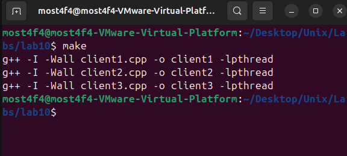
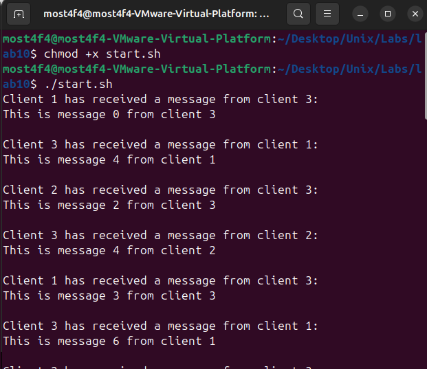
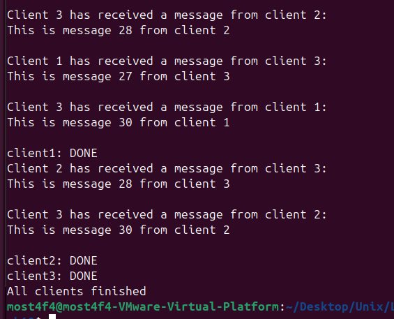

# Shared Memory & Semaphore IPC System

## Overview

This project demonstrates advanced **Inter-Process Communication (IPC)** using **System V Shared Memory** and **POSIX Named Semaphores** to enable synchronized message exchange between multiple client processes. The system showcases critical synchronization concepts including **mutual exclusion**, **race condition prevention**, and **resource management** in a multi-process environment.

## Key Features

- **System V Shared Memory**: High-performance zero-copy message passing
- **POSIX Named Semaphores**: Cross-process synchronization primitives
- **Mutual Exclusion**: Thread-safe access to shared resources
- **Race Condition Prevention**: Atomic operations on shared data
- **Graceful Resource Cleanup**: Proper IPC resource deallocation
- **Signal Handling**: Controlled shutdown on SIGINT
- **Round-Robin Communication**: Deterministic message routing pattern

## System Architecture

### Communication Model

```
┌─────────────┐    ┌─────────────────────┐    ┌─────────────┐
│   Client 1  │◄──►│   Shared Memory     │◄──►│   Client 2  │
│             │    │                     │    │             │
│ • Receives  │    │ ┌─────────────────┐ │    │ • Receives  │
│ • Processes │    │ │ struct Memory   │ │    │ • Processes │
│ • Forwards  │    │ │ - packet_no     │ │    │ • Forwards  │
└─────────────┘    │ │ - srcClientNo   │ │    └─────────────┘
       ▲           │ │ - destClientNo  │ │           ▲
       │           │ │ - message[1024] │ │           │
       │           │ └─────────────────┘ │           │
       │           └─────────────────────┘           │
       │                     ▲                       │
       │                     │                       │
       └─────────────────────┼───────────────────────┘
                             │
                    ┌─────────────┐
                    │   Client 3  │
                    │             │
                    │ • Initiator │
                    │ • Receives  │
                    │ • Processes │
                    │ • Forwards  │
                    └─────────────┘
```

### Synchronization Architecture

```
Named Semaphore: "semName"
┌─────────────────────────────────────┐
│ State: Available (1) / Busy (0)     │
├─────────────────────────────────────┤
│ sem_wait() → Acquire (Blocks if 0)  │
│ sem_post() → Release (Increments)   │
└─────────────────────────────────────┘

Critical Section Protection:
┌─────────────────────────────────────┐
│ sem_wait(sem_id)                    │
│ ┌─────────────────────────────────┐ │
│ │ // CRITICAL SECTION             │ │
│ │ - Read shared memory            │ │
│ │ - Process message               │ │
│ │ - Write new message             │ │
│ │ - Update routing fields         │ │
│ └─────────────────────────────────┘ │
│ sem_post(sem_id)                    │
└─────────────────────────────────────┘
```

## Technical Implementation

### Shared Memory Structure

```cpp
struct Memory {
    int            packet_no;      // Message sequence number
    unsigned short srcClientNo;   // Source client ID (1, 2, or 3)
    unsigned short destClientNo;  // Destination client ID (1, 2, or 3)
    char           message[BUF_LEN]; // Message payload (1024 bytes)
};
```

### Message Routing Logic

| Client       | Destination Pattern | Algorithm         |
| ------------ | ------------------- | ----------------- |
| **Client 1** | 2 → 3 → 2 → 3...    | `2 + i % 2`       |
| **Client 2** | 1 → 3 → 1 → 3...    | `1 + 2 * (i % 2)` |
| **Client 3** | 1 → 2 → 1 → 2...    | `1 + i % 2`       |

### IPC Resource Management

#### **Shared Memory Operations**

```cpp
// 1. Generate unique key
key_t ShmKey = ftok(MEMNAME, 65);

// 2. Create/access shared memory segment
int ShmID = shmget(ShmKey, sizeof(struct Memory), IPC_CREAT | 0666);

// 3. Attach to process address space
struct Memory* ShmPTR = (struct Memory*)shmat(ShmID, NULL, 0);

// 4. Cleanup on exit
shmdt((void*)ShmPTR);           // Detach from process
shmctl(ShmID, IPC_RMID, NULL);  // Mark for removal
```

#### **Named Semaphore Operations**

```cpp
// 1. Create/open named semaphore
sem_t* sem_id = sem_open(semName, O_CREAT, SEM_PERMS, 0);

// 2. Acquire semaphore (blocking)
sem_wait(sem_id);  // Decrements semaphore, blocks if zero

// 3. Release semaphore
sem_post(sem_id);  // Increments semaphore, wakes waiting processes

// 4. Cleanup
sem_close(sem_id);     // Close process reference
sem_unlink(semName);   // Remove from system namespace
```

## Build and Run Instructions

### Prerequisites

- **Operating System**: Linux/Unix with POSIX compliance
- **Compiler**: g++ with threading support
- **Libraries**: pthread, rt (real-time extensions)
- **Permissions**: User access to `/dev/shm` (shared memory filesystem)

### Compilation

```bash
# Build all three client executables
make

# This creates:
# - client1
# - client2
# - client3
```


_Successful compilation of all client executables_

### Execution

#### Using Start Script (Recommended)

```bash
chmod +x start.sh
./start.sh
```

The script executes:

```bash
./client1 &    # Start client1 in background
sleep 1        # 1-second delay for initialization
./client2 &    # Start client2 in background
sleep 1        # 1-second delay for initialization
./client3 &    # Start client3 in background (initiator)
wait           # Wait for all background processes
echo "All clients finished"
```



_Synchronized startup of all three clients_



_All three clients finished their tasks_

## Communication Flow Analysis

### Initialization Sequence

1. **Client 3** starts and initializes the first message:

   ```cpp
   ShmPTR->srcClientNo = 3;
   ShmPTR->destClientNo = 1;  // Send to Client 1
   sprintf(ShmPTR->message, "This is message 0 from client 3");
   sem_post(sem_id);  // Release semaphore to start communication
   ```

2. **Clients 1 & 2** wait for `destClientNo` to match their ID

### Message Routing Cycle

```
Cycle 1: Client 3 → Client 1 → Client 2 → Client 3
Cycle 2: Client 3 → Client 2 → Client 1 → Client 3
Cycle 3: Client 3 → Client 1 → Client 2 → Client 3
...
```

### Synchronization Mechanism

Each message exchange follows this pattern:

```cpp
// 1. Check if message is for this client
if (ShmPTR->destClientNo == CLIENT_NO) {

    // 2. Acquire exclusive access
    sem_wait(sem_id);  // CRITICAL SECTION START

    // 3. Process incoming message
    cout << "Client " << CLIENT_NO << " received: " << ShmPTR->message;

    // 4. Prepare outgoing message
    ShmPTR->srcClientNo = CLIENT_NO;
    ShmPTR->destClientNo = calculate_next_destination();
    sprintf(ShmPTR->message, "Message %d from client %d", i, CLIENT_NO);

    // 5. Release exclusive access
    sem_post(sem_id);  // CRITICAL SECTION END
}
```

## Advanced Concepts Demonstrated

### 1. **Race Condition Prevention**

**Without Synchronization (Problematic):**

```
Client 1: Read destClientNo = 1 ✓
Client 2: Read destClientNo = 1 ✓  (Race condition!)
Client 1: Write new message
Client 2: Write new message       (Overwrites Client 1's message)
```

**With Semaphore Synchronization (Correct):**

```
Client 1: sem_wait() → Success, enters critical section
Client 2: sem_wait() → Blocks, waits for semaphore
Client 1: Process message, sem_post() → Exits critical section
Client 2: sem_wait() → Success, now enters critical section
```

### 2. **Atomic Operations**

The semaphore ensures atomic execution of:

- Message reading
- Destination checking
- Message writing
- Routing field updates

### 3. **Resource Lifecycle Management**

```cpp
// Creation Phase
key_t key = ftok(MEMNAME, 65);              // Generate unique key
int shmid = shmget(key, size, IPC_CREAT);   // Create shared memory
void* ptr = shmat(shmid, NULL, 0);          // Attach to process
sem_t* sem = sem_open(name, O_CREAT, ...);  // Create named semaphore

// Usage Phase
sem_wait(sem);  // Acquire
// ... critical section ...
sem_post(sem);  // Release

// Cleanup Phase
shmdt(ptr);                    // Detach shared memory
shmctl(shmid, IPC_RMID, NULL); // Mark for removal
sem_close(sem);                // Close semaphore reference
sem_unlink(name);              // Remove from namespace
```

## Performance Analysis

### Synchronization Overhead

- **Semaphore Operations**: ~1-10 microseconds per acquire/release
- **Shared Memory Access**: Near-zero copy overhead
- **Context Switching**: Minimal due to shared memory (no kernel copies)
- **Total Latency**: Sub-millisecond message passing

### Scalability Characteristics

- **Memory Usage**: O(1) - single shared segment regardless of client count
- **Synchronization**: O(n) blocking with n clients competing
- **Throughput**: Limited by slowest client + synchronization overhead

## Troubleshooting

### Common Issues

1. **Semaphore Already Exists**

   ```bash
   # List named semaphores
   ls /dev/shm/sem.*

   # Remove specific semaphore
   rm /dev/shm/sem.semName
   ```

2. **Shared Memory Segment Not Cleaned**

   ```bash
   # List shared memory segments
   ipcs -m

   # Remove specific segment
   ipcrm -m <shmid>
   ```

3. **Permission Denied**

   ```bash
   # Check /dev/shm permissions
   ls -la /dev/shm/

   # Ensure user can create files in /dev/shm
   touch /dev/shm/test && rm /dev/shm/test
   ```

4. **Process Synchronization Issues**

   ```bash
   # Kill all client processes
   pkill -f client[123]

   # Check for zombie processes
   ps aux | grep client
   ```

### Debug Mode

Add debug output to trace synchronization:

```cpp
#ifdef DEBUG
    printf("Client %d: Acquiring semaphore...\n", CLIENT_NO);
    sem_wait(sem_id);
    printf("Client %d: Semaphore acquired\n", CLIENT_NO);
    // ... critical section ...
    printf("Client %d: Releasing semaphore\n", CLIENT_NO);
    sem_post(sem_id);
#endif
```

## Educational Objectives

### IPC Mechanisms

- **System V Shared Memory**: High-performance data sharing
- **POSIX Named Semaphores**: Cross-process synchronization
- **ftok() Key Generation**: IPC resource identification

### Synchronization Concepts

- **Critical Sections**: Protecting shared data access
- **Mutual Exclusion**: Preventing concurrent access
- **Deadlock Avoidance**: Proper resource acquisition ordering
- **Resource Cleanup**: Preventing IPC resource leaks

### System Programming

- **Process Management**: Multi-process coordination
- **Signal Handling**: Graceful shutdown mechanisms
- **Error Handling**: Robust system call error checking
- **Resource Lifecycle**: Creation, usage, and cleanup patterns

## File Structure

```
├── Makefile              # Build configuration
├── README.md            # Project documentation
├── client.h             # Shared constants and structures
├── client1.cpp          # Client 1 implementation
├── client2.cpp          # Client 2 implementation
├── client3.cpp          # Client 3 implementation (initiator)
├── start.sh             # Synchronized startup script
└── screenshots/         # Documentation images
    ├── system_architecture.png
    ├── make_build.png
    ├── start_script.png
    ├── message_flow.png
    └── routing_pattern.png
```

## Extensions and Enhancements

### Potential Improvements

1. **Dynamic Client Count**: Support variable number of clients
2. **Message Acknowledgments**: Ensure reliable message delivery
3. **Priority Messaging**: Different message priority levels
4. **Circular Buffer**: Multiple concurrent messages
5. **Performance Metrics**: Latency and throughput measurement
6. **Web Monitoring**: Real-time visualization of message flow

### Advanced Features

1. **Distributed Consensus**: Leader election among clients
2. **Load Balancing**: Distribute work across available clients
3. **Fault Tolerance**: Handle client failures gracefully
4. **Message Persistence**: Survive system restarts

## Dependencies

- **Compiler**: g++ with C++11 support
- **Libraries**:
  - `pthread` (POSIX threads)
  - `rt` (real-time extensions)
- **System**: Linux with POSIX IPC support
- **Filesystem**: `/dev/shm` for named semaphores

## Video Demonstration

[📹 YouTube Demo](https://youtu.be/gff8NTRYiSI) - Complete system walkthrough and synchronization demonstration

## License

This program is for educational purposes and is free to use and modify.

## Author

**Mostafa Hasanalipourshahrabadi**

- Demonstrates advanced IPC and synchronization concepts
- Production-ready resource management patterns
- Tested and validated on Linux VM environments

---

_This project provides hands-on experience with fundamental operating system concepts including inter-process communication, synchronization primitives, and resource management - essential knowledge for systems programming._
