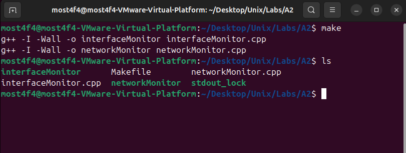
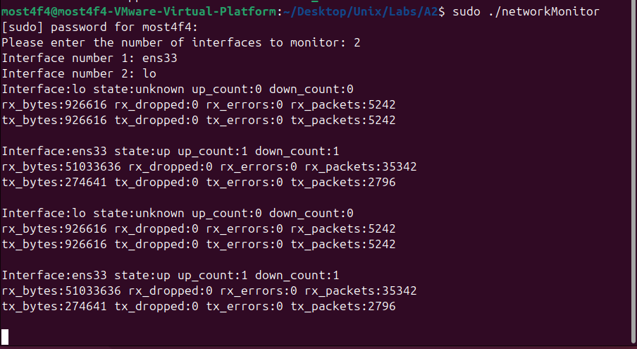
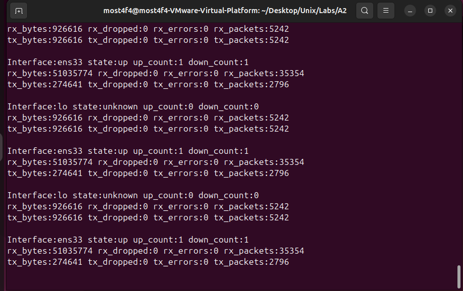
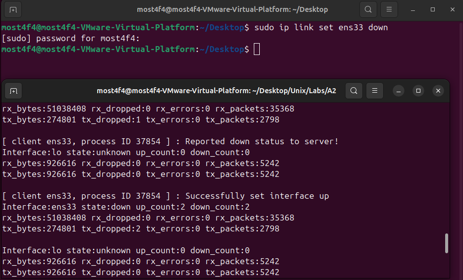
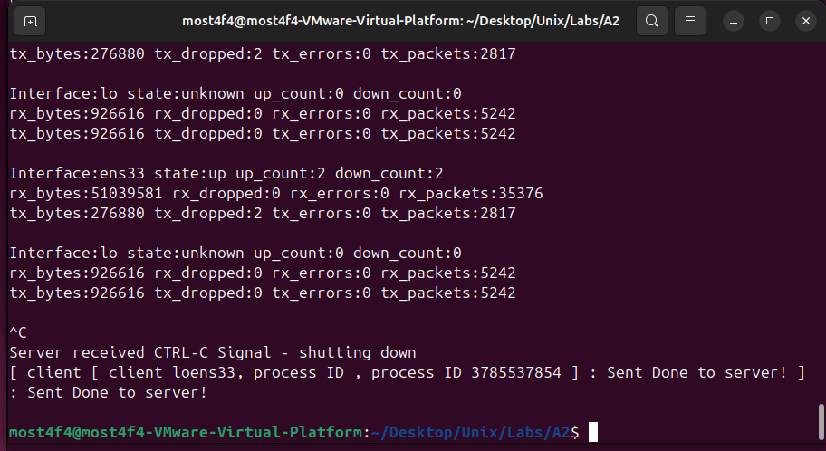
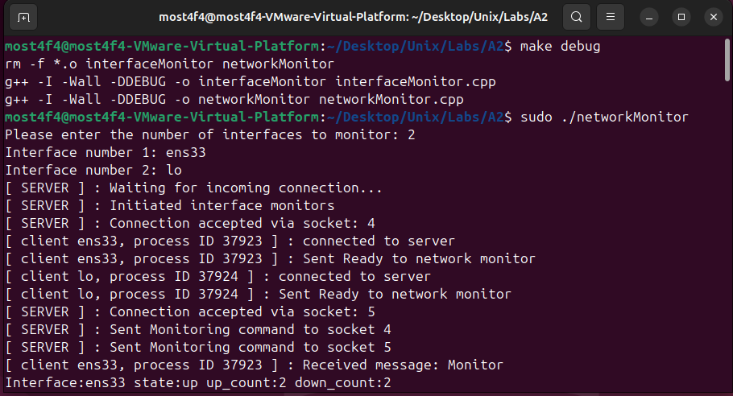

# Network Monitor System - Advanced IPC & Interface Management

## Overview

This project implements a **distributed network interface monitoring system** using advanced **Inter-Process Communication (IPC)**, **Unix domain sockets**, **process forking**, and **real-time file system monitoring**. The system demonstrates enterprise-level network monitoring concepts including **multi-process coordination**, **file locking mechanisms**, **signal handling**, and **automatic interface recovery**.

## Key Features

- **Multi-Process Architecture**: Dedicated monitor process per network interface
- **Unix Domain Socket IPC**: High-performance local communication between processes
- **Real-Time Statistics Monitoring**: Live polling from `/sys/class/net/` filesystem
- **Automatic Interface Recovery**: Detects down interfaces and brings them back up
- **File Locking Synchronization**: Prevents interleaved output from concurrent processes
- **Signal-Based Shutdown**: Graceful cleanup on SIGINT (Ctrl+C)
- **Non-blocking I/O**: Asynchronous socket communication with `select()`
- **Process Management**: Parent-child coordination with fork/exec pattern
- **Debug Mode Support**: Comprehensive logging for development and troubleshooting

## System Architecture

### Process Hierarchy

```
                    ┌─────────────────────────────┐
                    │      NETWORK MONITOR        │
                    │      (Parent Process)       │
                    │                             │
                    │ • User Interface            │
                    │ • Socket Server             │
                    │ • Process Management        │
                    │ • Signal Handling           │
                    │ • select() Event Loop       │
                    └──────────────┬──────────────┘
                                   │
                            ┌──────┴──────┐
                            │   fork()    │
                            └──────┬──────┘
                                   │
        ┌──────────────────────────┼──────────────────────────┐
        ▼                          ▼                          ▼
┌─────────────────┐      ┌─────────────────┐      ┌─────────────────┐
│Interface Monitor│      │Interface Monitor│      │Interface Monitor│
│   (Child 1)     │      │   (Child 2)     │      │   (Child N)     │
│                 │      │                 │      │                 │
│ • Monitor ens33 │      │ • Monitor lo    │      │ • Monitor wlan0 │
│ • Poll stats    │      │ • Poll stats    │      │ • Poll stats    │
│ • Detect down   │      │ • Detect down   │      │ • Detect down   │
│ • Send alerts   │      │ • Send alerts   │      │ • Send alerts   │
│ • ioctl recovery│      │ • ioctl recovery│      │ • ioctl recovery│
└─────────────────┘      └─────────────────┘      └─────────────────┘
```

### Communication Protocol

```
Unix Domain Socket: /tmp/assignment2
┌─────────────────────────────────────────────────────────────────────┐
│                    Message Protocol Flow                            │
├─────────────────────────────────────────────────────────────────────┤
│ 1. Client → Server: "Ready"           (Connection established)      │
│ 2. Server → Client: "Monitor"         (Start monitoring command)    │
│ 3. Client → Server: "Monitoring"      (Acknowledgment)              │
│ 4. Client → Server: "Link Down"       (Interface down detected)     │
│ 5. Server → Client: "Set Link Up"     (Recovery command)            │
│ 6. Server → Client: "Shut Down"       (Termination signal)          │
│ 7. Client → Server: "Done"            (Clean shutdown)              │
└─────────────────────────────────────────────────────────────────────┘
```

### File System Integration

```
Linux Network Interface Statistics (/sys/class/net/<interface>/)
┌─────────────────────────────────────────────────────────────────────┐
│ operstate              │ Interface state (up/down/unknown)          │
│ carrier_up_count       │ Number of times interface came up          │
│ carrier_down_count     │ Number of times interface went down        │
│ statistics/rx_bytes    │ Total bytes received                       │
│ statistics/rx_packets  │ Total packets received                     │
│ statistics/rx_errors   │ Receive errors count                       │
│ statistics/rx_dropped  │ Dropped receive packets                    │
│ statistics/tx_bytes    │ Total bytes transmitted                    │
│ statistics/tx_packets  │ Total packets transmitted                  │
│ statistics/tx_errors   │ Transmission errors count                  │
│ statistics/tx_dropped  │ Dropped transmit packets                   │
└─────────────────────────────────────────────────────────────────────┘
```

## Technical Implementation

### Network Monitor (Server) Architecture

```cpp
// Multi-client socket server with select()
fd_set readfds;
int max_socket = server_socket;

while (isRunning) {
    FD_ZERO(&readfds);
    FD_SET(server_socket, &readfds);

    for (int sock : monitor_sockets) {
        FD_SET(sock, &readfds);
    }

    int result = select(max_socket + 1, &readfds, nullptr, nullptr, nullptr);

    // Handle ready file descriptors
    for (size_t i = 0; i < monitor_sockets.size(); i++) {
        if (FD_ISSET(monitor_sockets[i], &readfds)) {
            // Process client message
        }
    }
}
```

### Interface Monitor (Client) Implementation

```cpp
// Non-blocking socket communication
int flags = fcntl(client_socket_fd, F_GETFL, 0);
fcntl(client_socket_fd, F_SETFL, flags | O_NONBLOCK);

while (isRunning) {
    // Check for server messages
    int bytesRead = read(client_socket_fd, buffer, sizeof(buffer) - 1);

    if (monitoring && isRunning) {
        printStats(interface);  // Output statistics
        checkLinkState(interface);  // Detect interface down
    }

    sleep(1);  // Poll every second
}
```

### File Locking for Thread-Safe Output

```cpp
// Exclusive write lock for synchronized output
int lock_fd = open(LOCK_FILE, O_CREAT | O_RDWR, 0777);
struct flock fl;
fl.l_type = F_WRLCK;      // Exclusive write lock
fl.l_whence = SEEK_SET;
fl.l_start = 0;
fl.l_len = 0;             // Lock entire file

fcntl(lock_fd, F_SETLKW, &fl);  // Blocking lock acquisition

// ... critical section (output statistics) ...

fl.l_type = F_UNLCK;      // Unlock
fcntl(lock_fd, F_SETLK, &fl);
close(lock_fd);
```

### Interface Recovery with ioctl

```cpp
// Bring interface up using ioctl system call
int fd = socket(AF_INET, SOCK_DGRAM, 0);
struct ifreq ifr;
strncpy(ifr.ifr_name, interface, IFNAMSIZ);
ifr.ifr_flags |= IFF_UP;  // Set UP flag

if (ioctl(fd, SIOCSIFFLAGS, &ifr) < 0) {
    perror("IOCTL failed");
    hasSetLinkUpFailed = true;  // Prevent repeated failures
} else {
    cout << "Successfully set interface up" << endl;
}
close(fd);
```

## Build and Run Instructions

### Prerequisites

- **Operating System**: Linux with `/sys/class/net/` filesystem support
- **Compiler**: g++ with C++11 support
- **Permissions**: Root privileges may be required for interface manipulation
- **Network Interfaces**: At least one network interface (e.g., `ens33`, `lo`, `wlan0`)

### Compilation

```bash
# Standard build
make

# Debug build with verbose logging
make debug

# Clean compiled files
make clean
```


_Successful compilation of network monitor components_

### Execution Workflow

#### Step 1: Run Network Monitor

```bash
./networkMonitor
```

**Interactive Setup:**

```
Please enter the number of interfaces to monitor: 2
Interface number 1: ens33
Interface number 2: lo
```


_Network monitor server initialization and interface selection_

#### Step 2: Monitor Output

**Expected Real-time Output:**

```
Interface:ens33 state:up up_count:1 down_count:0
rx_bytes:524288 rx_dropped:0 rx_errors:0 rx_packets:2048
tx_bytes:262144 tx_dropped:0 tx_errors:0 tx_packets:1024

Interface:lo state:up up_count:1 down_count:0
rx_bytes:1048576 rx_dropped:0 rx_errors:0 rx_packets:4096
tx_bytes:1048576 tx_dropped:0 tx_errors:0 tx_packets:4096
```


_Real-time interface statistics being displayed_

#### Step 3: Test Interface Recovery

**Simulate Interface Down:**

```bash
sudo ip link set ens33 down
```

**Expected Recovery Sequence:**

```
[ client ens33, process ID 12345 ] : Reported down status to server!
[ client ens33, process ID 12345 ] : Successfully set interface up
```


_Automatic interface recovery demonstration_

#### Step 4: Graceful Shutdown

**Press Ctrl+C in server terminal:**

```
^C
Server received CTRL-C Signal - shutting down
[ client ens33, process ID 12345 ] : Sent Done to server!
[ client lo, process ID 12346 ] : Sent Done to server!
```


_Clean shutdown with process cleanup_

## Advanced Features Deep Dive

### 1. **Multi-Process Coordination**

```cpp
// Parent process manages multiple child processes
vector<int> monitor_sockets;
vector<pid_t> child_pids;

for (int i = 0; i < numInterfaces; i++) {
    child_pids[i] = fork();
    if (child_pids[i] == 0) {
        // Child process: execute interface monitor
        execlp("./interfaceMonitor", "./interfaceMonitor",
               interfaceNames[i].c_str(), nullptr);
    }
}
```

### 2. **Event-Driven I/O with select()**

```cpp
// Monitor multiple file descriptors simultaneously
fd_set readfds;
FD_ZERO(&readfds);
FD_SET(server_socket, &readfds);

for (int sock : monitor_sockets) {
    FD_SET(sock, &readfds);
}

// Block until any file descriptor is ready
int result = select(max_socket + 1, &readfds, nullptr, nullptr, nullptr);

// Handle ready descriptors
for (size_t i = 0; i < monitor_sockets.size(); i++) {
    if (FD_ISSET(monitor_sockets[i], &readfds)) {
        // Process message from this client
    }
}
```

### 3. **File System Statistics Parsing**

```cpp
// Lambda function for robust file reading
auto read_stat = [&](const string& stat_path) {
    ifstream file(base + stat_path);
    if (file.is_open()) {
        string value;
        getline(file, value);
        return value;
    }
    return string("0");  // Default on failure
};

// Usage for various statistics
cout << "rx_bytes:" << read_stat("statistics/rx_bytes")
     << " tx_packets:" << read_stat("statistics/tx_packets");
```

### 4. **Signal Handling for Clean Shutdown**

```cpp
// Global state management
volatile bool isRunning = true;

void signalHandler(int signal) {
    if (signal == SIGINT) {
        cout << "\nServer received CTRL-C Signal - shutting down" << endl;
        isRunning = false;
    }
}

// Register signal handler
struct sigaction sa;
sa.sa_handler = signalHandler;
sigemptyset(&sa.sa_mask);
sa.sa_flags = 0;
sigaction(SIGINT, &sa, nullptr);
```

### 5. **Resource Cleanup Management**

```cpp
void shutdownClients() {
    // Send shutdown message to all clients
    char shutdown_msg[] = "Shut Down";
    for (int client : monitor_sockets) {
        write(client, shutdown_msg, sizeof(shutdown_msg));
        close(client);
    }

    // Terminate child processes
    for (pid_t pid : child_pids) {
        if (pid > 0) {
            kill(pid, SIGINT);
            waitpid(pid, nullptr, 0);
        }
    }

    // Clean up IPC resources
    monitor_sockets.clear();
    unlink(SOCKET_PATH);
}
```

## Performance Analysis

### System Resource Usage

```
Per Interface Monitor Process:
┌─────────────────────────────────────────────────────────────────┐
│ Memory Usage:        ~2-4 MB per process                        │
│ CPU Usage:           ~0.1% per interface (1-second polling)     │
│ File Descriptors:    3-5 per process (socket, stats files)      │
│ Disk I/O:           ~10 file reads/second per interface         │
│ Network I/O:        Minimal (Unix domain sockets only)          │
└─────────────────────────────────────────────────────────────────┘

Scalability Characteristics:
┌─────────────────────────────────────────────────────────────────┐
│ Max Interfaces:      Limited by MAX_NUMBER_CONNECTIONS (10)     │
│ Response Time:       Sub-millisecond for local communication    │
│ Polling Frequency:   1 Hz (configurable via sleep(1))           │
│ Recovery Time:       ~1-2 seconds for interface up/down cycle   │
└─────────────────────────────────────────────────────────────────┘
```

### Performance Optimization

```bash
# Monitor system resource usage
top -p $(pgrep -f networkMonitor)

# Check file descriptor usage
lsof -p $(pgrep -f interfaceMonitor)

# Monitor network interface performance
watch -n 1 'cat /proc/net/dev'
```

## Debug Mode and Troubleshooting

### Enable Debug Output

```bash
# Compile with debug symbols
make debug

# Run with verbose logging
./networkMonitor
```

**Debug Output Examples:**

```
[ SERVER ] : Waiting for incoming connection...
[ SERVER ] : Connection accepted via socket: 4
[ client ens33, process ID 12345 ] : connected to server
[ client ens33, process ID 12345 ] : Sent Ready to network monitor
[ SERVER ] : Sent Monitoring command to socket 4
[ client ens33, process ID 12345 ] : Received message: Monitor
```


_Comprehensive debug logging showing IPC communication_

### Common Issues and Solutions

1. **Permission Denied for Interface Control**

   ```bash
   # Run with elevated privileges
   sudo ./networkMonitor

   # Or add user to netdev group
   sudo usermod -a -G netdev $USER
   ```

2. **Socket Already in Use**

   ```bash
   # Remove stale socket file
   rm -f /tmp/assignment2

   # Check for running processes
   ps aux | grep -E "(networkMonitor|interfaceMonitor)"
   ```

3. **Interface Not Found**

   ```bash
   # List available interfaces
   ls /sys/class/net/

   # Check interface status
   ip link show
   ```

4. **File Lock Contention**

   ```bash
   # Remove lock file if stale
   rm -f ./stdout_lock

   # Check for hanging processes
   lsof ./stdout_lock
   ```

### Testing Interface Recovery

```bash
# Test interface down/up cycle
sudo ip link set ens33 down
sleep 2
ip link show ens33  # Should show UP after automatic recovery

# Monitor kernel messages
dmesg | tail -f | grep ens33

# Check interface statistics
cat /sys/class/net/ens33/operstate
```

## Educational Objectives

### System Programming Concepts

1. **Inter-Process Communication**: Unix domain sockets for local IPC
2. **Process Management**: Fork/exec pattern for process creation
3. **Event-Driven Programming**: select() for multiplexed I/O
4. **File System Integration**: Reading from /sys virtual filesystem
5. **Signal Handling**: Graceful shutdown mechanisms

### Network Programming

1. **Interface Management**: ioctl for network interface control
2. **Statistics Monitoring**: Real-time performance metrics
3. **State Detection**: Link up/down status monitoring
4. **Automatic Recovery**: Self-healing network configuration

### Advanced Topics

1. **File Locking**: Synchronization between concurrent processes
2. **Non-blocking I/O**: Asynchronous socket communication
3. **Resource Management**: Proper cleanup and leak prevention
4. **Error Handling**: Robust system call error checking

## Extensions and Future Enhancements

### Web Dashboard Integration

```html
<!-- Real-time web interface concept -->
<div id="interface-dashboard">
  <div class="interface-card" id="ens33">
    <h3>Interface: ens33</h3>
    <div class="status up">Status: UP</div>
    <div class="stats">
      <span>RX: 524MB</span>
      <span>TX: 262MB</span>
    </div>
  </div>
</div>
```

### Enhanced Monitoring Features

```cpp
// Historical data storage
struct InterfaceHistory {
    std::vector<StatSnapshot> snapshots;
    time_t last_update;
    double average_throughput;
    int error_count;
};

// Alerting system
void checkThresholds(const InterfaceStats& stats) {
    if (stats.error_rate > ERROR_THRESHOLD) {
        sendAlert("High error rate detected");
    }
    if (stats.throughput < THROUGHPUT_THRESHOLD) {
        sendAlert("Low throughput detected");
    }
}
```

### Performance Improvements

1. **Configurable Polling**: Adjust monitoring frequency per interface
2. **Batch Statistics**: Collect multiple metrics in single operation
3. **Memory Pools**: Reduce allocation overhead
4. **Compressed Logs**: Efficient storage of historical data

## File Structure

```
├── Makefile                  # Build configuration with debug support
├── README.md                # Project documentation
├── networkMonitor.cpp       # Server process (parent)
├── interfaceMonitor.cpp     # Client process (children)
├── stdout_lock             # File locking mechanism (created at runtime)
└── screenshots/            # Documentation images
    ├── make_build.png
    ├── server_startup.png
    ├── live_monitoring.png
    ├── interface_recovery.png
    ├── graceful_shutdown.png
    └── debug_mode.png
```

## Real-World Applications

### Network Operations Centers (NOC)

- **Infrastructure Monitoring**: Real-time network health dashboards
- **Fault Detection**: Automatic detection of interface failures
- **Performance Analysis**: Historical trend analysis and capacity planning
- **Automated Recovery**: Self-healing network infrastructure

### System Administration

- **Server Monitoring**: Track network interface performance on servers
- **Troubleshooting**: Identify network bottlenecks and errors
- **Capacity Planning**: Analyze traffic patterns for resource allocation
- **Compliance**: Network performance reporting for SLA monitoring

### Development and Testing

- **Load Testing**: Monitor interface performance under stress
- **Performance Regression**: Detect performance degradation in updates
- **Network Simulation**: Test applications under various network conditions
- **Debugging**: Identify network-related application issues

## Dependencies

- **Compiler**: g++ with C++11 support
- **System Libraries**:
  - `sys/socket.h` (socket programming)
  - `sys/un.h` (Unix domain sockets)
  - `net/if.h` (network interface operations)
  - `fcntl.h` (file locking)
- **Operating System**: Linux with `/sys/class/net/` support
- **Permissions**: Root access for interface manipulation (optional)
- **Network Interfaces**: At least one active network interface

## License

This program is for educational purposes and is free to use and modify.

## Author

**Mostafa Hasanalipourshahrabadi**

- Advanced system programming and network monitoring
- Multi-process IPC architecture implementation
- Real-time performance monitoring systems
- Tested and validated on Linux VM environments

---

_This project demonstrates enterprise-level network monitoring concepts with practical implementation of IPC, process management, and real-time system monitoring - essential skills for system programming and network operations._
