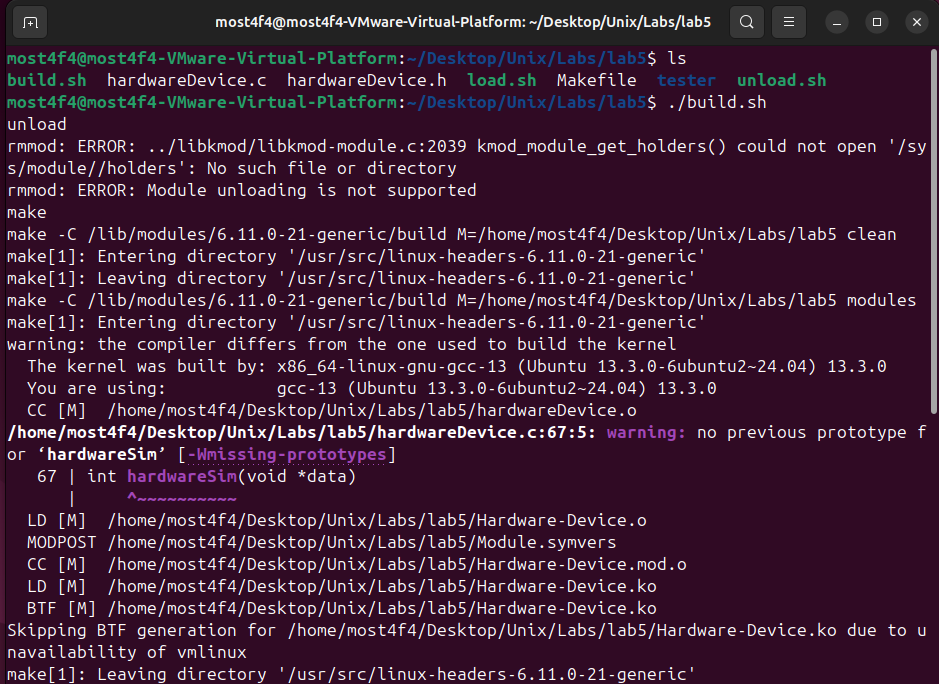
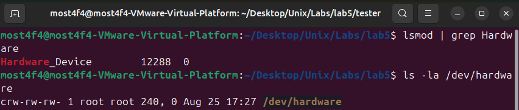
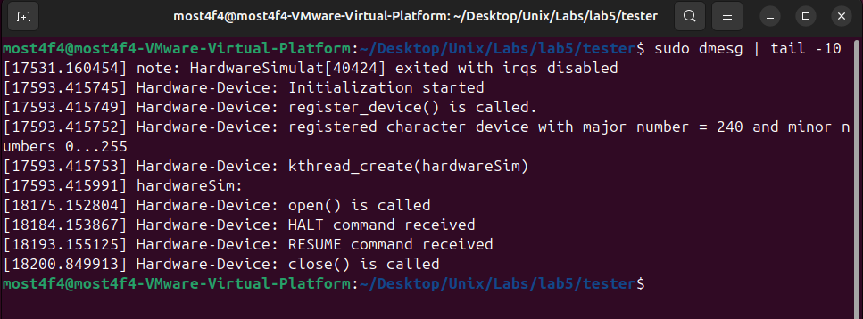
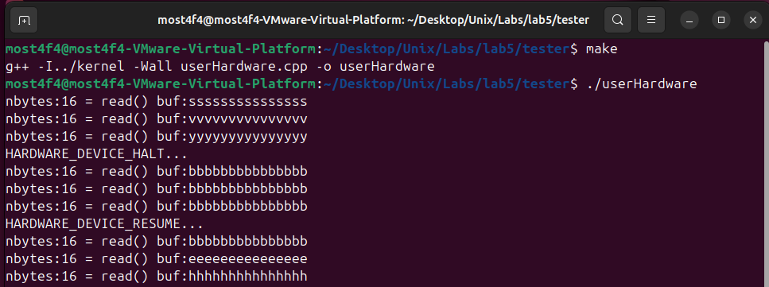

# Linux Kernel Module - Hardware Device Driver

## Overview

This project implements a **Linux kernel module** that simulates a hardware device driver using **character device interface**, **kernel threading**, **ioctl system calls**, and **kernel-userspace communication**. The driver demonstrates advanced kernel programming concepts including **device registration**, **file operations**, **kernel threads**, **memory management**, and **synchronization mechanisms**.

## Key Features

- **Character Device Driver**: Standard Linux device file interface (`/dev/Hardware-Device`)
- **Kernel Threading**: Background kernel thread for hardware simulation
- **ioctl Interface**: Custom control commands (HALT/RESUME operations)
- **Kernel-Userspace Communication**: Safe data transfer using `copy_to_user()`
- **Dynamic Device Registration**: Runtime character device creation
- **Hardware Simulation**: Continuous data generation in kernel space
- **Memory Management**: Kernel buffer management and synchronization
- **Module Lifecycle**: Proper initialization and cleanup procedures

## System Architecture

### Kernel Module Structure

```
┌─────────────────────────────────────────────────────────────────────┐
│                        KERNEL SPACE                                 │
├─────────────────────────────────────────────────────────────────────┤
│  ┌─────────────────────┐    ┌─────────────────────────────────────┐ │
│  │   Kernel Module     │    │        Kernel Thread                │ │
│  │   (hardwareDevice)  │    │        (hardwareSim)                │ │
│  │                     │    │                                     │ │
│  │ • Device Registration│   │ • Continuous data generation        │ │
│  │ • File Operations   │    │ • Buffer updates (a->b->c->...->z)  │ │
│  │ • ioctl Handling    │◄──►│ • Sleep/wake cycles (1 second)      │ │
│  │ • Memory Management │    │ • Halt/resume control               │ │
│  │ • Cleanup Procedures│    │ • Thread lifecycle management       │ │
│  └─────────────────────┘    └─────────────────────────────────────┘ │
│           ▲                                                         │
├───────────┼─────────────────────────────────────────────────────────┤
│           ▼                                                         │
│  ┌─────────────────────────────────────────────────────────────┐    │
│  │              Character Device Interface                     │    │
│  │              /dev/Hardware-Device                           │    │
│  │              Major: <dynamic>  Minor: 0-255                 │    │
│  └─────────────────────────────────────────────────────────────┘    │
└─────────────────────────────────────────────────────────────────────┘
                                 ▲
                                 │ System Calls
                                 ▼
┌─────────────────────────────────────────────────────────────────────┐
│                        USER SPACE                                   │
├─────────────────────────────────────────────────────────────────────┤
│  ┌─────────────────┐  ┌─────────────────┐  ┌──────────────────┐     │
│  │ User Application│  │ Device Control  │  │ System Utilities │     │
│  │                 │  │ Program         │  │ (cat, echo)      │     │
│  │ • open()        │  │ • ioctl() calls │  │ • Device access  │     │
│  │ • read()        │  │ • HALT/RESUME   │  │ • File operations│     │
│  │ • close()       │  │ • Error handling│  │ • Testing        │     │
│  └─────────────────┘  └─────────────────┘  └──────────────────┘     │
└─────────────────────────────────────────────────────────────────────┘
```

### Device Operations Flow

```
Device Operations:
┌─────────────────────────────────────────────────────────────────────┐
│ 1. Module Load:    insmod Hardware-Device.ko                        │
│ 2. Registration:   register_chrdev() → /dev/Hardware-Device         │
│ 3. Thread Create:  kthread_create(hardwareSim) → Background thread  │
│ 4. User Access:    open("/dev/Hardware-Device") → device_open()     │
│ 5. Read Data:      read() → hardware_device_read() → copy_to_user() │
│ 6. Control:        ioctl() → HALT/RESUME commands                   │
│ 7. Close:          close() → hardware_device_close()                │
│ 8. Module Unload:  rmmod Hardware-Device → cleanup procedures       │
└─────────────────────────────────────────────────────────────────────┘
```

## Build and Installation Instructions

### Prerequisites

- **Operating System**: Linux with kernel headers installed
- **Compiler**: GCC compatible with your kernel version
- **Headers**: Kernel development headers (`linux-headers-$(uname -r)`)
- **Permissions**: Root access for module loading/unloading

### Install Prerequisites

```bash
# Ubuntu/Debian
sudo apt-get update
sudo apt-get install linux-headers-$(uname -r) build-essential

# CentOS/RHEL/Fedora
sudo yum install kernel-devel gcc make
# OR for newer versions:
sudo dnf install kernel-devel gcc make

# Check kernel headers installation
ls /lib/modules/$(uname -r)/build
```

### File Structure Setup

```
├── Makefile              # Kernel module build configuration
├── hardwareDevice.c      # Main kernel module implementation
├── hardwareDevice.h      # Header file with ioctl definitions
├── tester
│  ├── Makefile           # Makefile for user-space test application
│  └── userHardware.cpp   # User-space test application
├── build.sh              # Complete build and load automation script
├── load.sh               # Module loading and device creation script
├── unload.sh             # Module unloading and cleanup script
├── README.md             # Project documentation
└── screenshots/          # Documentation images
```

### Compilation and Installation (Automated Method - Recommended)

**Using the provided automation scripts:**

```bash
# Make scripts executable
chmod +x build.sh load.sh unload.sh

# Complete build, load, and test cycle
./build.sh
```

The `build.sh` script performs:

1. Unloads any existing module
2. Cleans and builds the kernel module
3. Loads the module and creates device file
4. Tails syslog for real-time kernel messages



_Complete automated build and load process_

**Verification after build.sh:**

```bash
# Check module is loaded
lsmod | grep Hardware

# Check device file exists
ls -la /dev/hardware

```



_Verify successful module loading and device file creation_

**The `build.sh` script handles everything automatically** - no need to run `load.sh` separately:

After `build.sh` completes, your module is loaded and ready to use.

#### Step 2: Check Kernel Messages

```bash
# View kernel log messages
dmesg | tail -10
```

**Expected Output:**

```
[12345.678] Hardware-Device: Initialization started
[12345.679] Hardware-Device: register_device() is called.
[12345.680] Hardware-Device: registered character device with major number = 245 and minor numbers 0...255
[12345.681] Hardware-Device: kthread_create(hardwareSim)
```



_Kernel module initialization messages_

#### Step 3: Test Device Operations with User Application

**Compile and run the provided test application:**

```bash
# Navigate to the tester directory
cd ./tester

# Compile the userHardware test program
make

# Run the test application
sudo ./userHardware
```

**Expected Output:**

```
nbytes:16 = read() buf:aaaaaaaaaaaaaaa
nbytes:16 = read() buf:bbbbbbbbbbbbbbb
nbytes:16 = read() buf:ccccccccccccccc
HARDWARE_DEVICE_HALT...
nbytes:16 = read() buf:ccccccccccccccc
nbytes:16 = read() buf:ccccccccccccccc
nbytes:16 = read() buf:ccccccccccccccc
HARDWARE_DEVICE_RESUME...
nbytes:16 = read() buf:ddddddddddddddd
nbytes:16 = read() buf:eeeeeeeeeeeeeee
nbytes:16 = read() buf:fffffffffffffff
```

This demonstrates:

1. **Normal Operation**: Characters increment every second (a→b→c)
2. **HALT Command**: Data stops changing (stays at 'c')
3. **RESUME Command**: Data continues incrementing (d→e→f)



_Complete test cycle showing HALT and RESUME functionality_

#### Step 4: Module Removal

**Automated Removal (Recommended):**

```bash
# Unload module and remove device file
sudo ./unload.sh
```

**The unload.sh script performs:**

1. Removes the module using `rmmod`
2. Deletes the `/dev/hardware` device file
3. Cleans up all resources

**Manual Removal (Alternative):**

```bash
# Remove device file
sudo rm /dev/hardware

# Unload the module
sudo rmmod Hardware-Device

# Verify removal
lsmod | grep Hardware
dmesg | tail -5
```

**Expected dmesg Output:**

```
[12445.123] Hardware-Device: Exiting
[12445.124] Hardware-Device: unregister_device() is called
```

## Advanced Kernel Programming Concepts

### Memory Management

```c
// Kernel space memory allocation (if needed)
char *kernel_buffer = kmalloc(BUF_LEN, GFP_KERNEL);
if (!kernel_buffer) {
    printk(KERN_ERR "Failed to allocate kernel memory\n");
    return -ENOMEM;
}

// Always free allocated memory
kfree(kernel_buffer);
```

### Synchronization Mechanisms

```c
// Mutex for thread safety (if needed)
#include <linux/mutex.h>

static DEFINE_MUTEX(device_mutex);

// In functions that access shared data:
mutex_lock(&device_mutex);
// Critical section
mutex_unlock(&device_mutex);
```

### Process Context vs Interrupt Context

```c
// Check if in interrupt context
if (in_interrupt()) {
    printk(KERN_WARNING "Cannot sleep in interrupt context\n");
    // Use GFP_ATOMIC for memory allocation
    // Cannot use msleep() or mutex_lock()
}
```

### Error Handling Best Practices

```c
static int __init hardware_device_init(void)
{
    int result = 0;

    result = register_chrdev(0, device_name, &simple_driver_fops);
    if (result < 0) {
        printk(KERN_ERR "Failed to register character device: %d\n", result);
        goto fail_chrdev;
    }

    threadPtr = kthread_create(hardwareSim, NULL, "HardwareSimulator");
    if (IS_ERR(threadPtr)) {
        result = PTR_ERR(threadPtr);
        printk(KERN_ERR "Failed to create kernel thread: %d\n", result);
        goto fail_kthread;
    }

    wake_up_process(threadPtr);
    return 0;

fail_kthread:
    unregister_chrdev(device_file_major_number, device_name);
fail_chrdev:
    return result;
}
```

## Performance Analysis

### Resource Usage

```
Kernel Module Resource Usage:
┌─────────────────────────────────────────────────────────────────┐
│ Memory Usage:       ~16KB (module code + data)                  │
│ Kernel Thread:      ~8KB stack space                            │
│ Buffer Size:        16 bytes                                    │
│ CPU Usage:          <0.01% (1-second sleep cycles)              │
│ System Calls:       O(1) for each operation                     │
└─────────────────────────────────────────────────────────────────┘

Performance Characteristics:
┌─────────────────────────────────────────────────────────────────┐
│ Device Registration: ~1-5 milliseconds                          │
│ Thread Creation:     ~10-50 milliseconds                        │
│ Read Operation:      ~1-10 microseconds                         │
│ ioctl Operation:     ~1-10 microseconds                         │
│ Data Update Rate:    1 Hz (1 second intervals)                  │
└─────────────────────────────────────────────────────────────────┘
```

### Benchmarking Commands

```bash
# Monitor kernel thread activity
ps aux | grep HardwareSimulator

# Check module memory usage
cat /proc/modules | grep Hardware

# Monitor system calls
strace -e openat,read,ioctl cat /dev/Hardware-Device

# Performance testing
time dd if=/dev/Hardware-Device of=/dev/null bs=1 count=1000
```

## Debugging and Troubleshooting

### Common Issues

1. **Module Load Failed**

   ```bash
   # Check kernel log for errors
   dmesg | grep -i error

   # Verify kernel headers
   uname -r
   ls /lib/modules/$(uname -r)/build
   ```

2. **Device File Creation Failed**

   ```bash
   # Check major number from dmesg
   dmesg | grep "major number"

   # Remove existing device file
   sudo rm -f /dev/Hardware-Device
   ```

3. **Permission Denied**

   ```bash
   # Check device file permissions
   ls -la /dev/Hardware-Device

   # Fix permissions
   sudo chmod 666 /dev/Hardware-Device
   ```

4. **Module Unload Failed**

   ```bash
   # Check if device is in use
   lsof /dev/Hardware-Device

   # Force removal (careful!)
   sudo rmmod -f Hardware-Device
   ```

### Debug Mode Implementation

Add debug macros for development:

```c
#ifdef DEBUG
#define DBG_PRINT(fmt, args...) printk(KERN_DEBUG "Hardware-Device: " fmt, ##args)
#else
#define DBG_PRINT(fmt, args...) /* nothing */
#endif

// Usage:
DBG_PRINT("Thread state: running=%d, halt=%d\n", is_running, is_halt);
```

Compile with debugging:

```bash
make EXTRA_CFLAGS="-DDEBUG"
```

### Kernel Debugging Tools

```bash
# Monitor kernel messages in real-time
sudo dmesg -w

# Check module information
modinfo Hardware-Device.ko

# View loaded module details
cat /proc/modules | grep Hardware

# Monitor kernel thread
ps -eo pid,comm,state | grep HardwareSimulator
```

## Technical Implementation

### Module Initialization

```c
static int hardware_device_init(void)
{
    int result = 0;
    printk(KERN_NOTICE "Hardware-Device: Initialization started\n");

    // Register character device with dynamic major number
    result = register_device();
    return result;
}

// Module entry and exit points
module_init(hardware_device_init);
module_exit(hardware_device_exit);
```

### Character Device Registration

```c
int register_device(void)
{
    int result = 0;

    // Register character device (major number assigned dynamically)
    result = register_chrdev(0, device_name, &simple_driver_fops);
    if (result < 0) {
        printk(KERN_WARNING "Hardware-Device: can't register character device with errorcode = %i\n", result);
        return result;
    }

    device_file_major_number = result;
    printk(KERN_NOTICE "Hardware-Device: registered character device with major number = %i\n",
           device_file_major_number);

    // Create and start kernel thread
    is_running = true;
    is_halt = false;
    threadPtr = kthread_create(hardwareSim, NULL, "HardwareSimulator");
    if (threadPtr) {
        wake_up_process(threadPtr);
    }

    return 0;
}
```

### File Operations Structure

```c
static struct file_operations simple_driver_fops = {
    .owner = THIS_MODULE,
    .read = hardware_device_read,           // Handle read() system calls
    .unlocked_ioctl = hardware_device_ioctl, // Handle ioctl() system calls
    .open = hardware_device_open,           // Handle open() system calls
    .release = hardware_device_close,       // Handle close() system calls
};
```

### Kernel Thread Implementation

```c
int hardwareSim(void *data)
{
    int i;

    // Initialize buffer with 'a' characters
    for(i = 0; i < BUF_LEN-1; ++i) {
        buffer[i] = 'a';
    }
    buffer[BUF_LEN-1] = '\0';

    while(is_running) {
        while(!is_halt) {
            // Increment each character in buffer (a->b->c->...->z->a)
            for(i = 0; i < BUF_LEN-1; ++i) {
                ++buffer[i];
                if(buffer[i] > 'z') buffer[i] = 'a';
            }
            buffer[BUF_LEN-1] = '\0';
            msleep(1000);  // Sleep for 1 second
        }
        msleep(1000);  // Sleep when halted
    }
    return 0;
}
```

### Safe Kernel-Userspace Communication

```c
static ssize_t hardware_device_read(struct file *filp, char __user *buf, size_t len, loff_t *off)
{
    // Determine the number of bytes to read, ensuring it doesn't exceed BUF_LEN
    int bytes_read = min(len, (size_t)BUF_LEN);

    // Copy data from kernel space to user space
    if (copy_to_user(buf, &buffer, bytes_read) != 0)
        return -EFAULT;  // Return error if copying fails

    return bytes_read; // Return the number of bytes successfully read
}
```

## User-Space Test Application

### Overview

The project includes a comprehensive user-space test application (`userHardware.cpp`) that demonstrates all device functionality:

```cpp
// userHardware.cpp - Complete device functionality test
#include <fcntl.h>
#include <stdio.h>
#include <string.h>
#include <sys/ioctl.h>
#include <unistd.h>
#include "hardwareDevice.h"

const char devFile[] = "/dev/hardware";
const int BUF_LEN = 16;

int main()
{
    int fd, rc = 0;
    char buf[BUF_LEN];
    int nbytes;

    // Open the device file
    fd = open(devFile, O_RDWR);
    if(fd < 0) {
        printf("Cannot open the device file...\n");
        rc = -1;
    }

    if(rc == 0) {
        // Test normal operation - 3 reads with 3-second intervals
        for(int i = 0; i < 3; ++i) {
            nbytes = read(fd, buf, BUF_LEN);
            printf("nbytes:%d = read() buf:%s\n", nbytes, buf);
            sleep(3);
        }

        // Test HALT functionality
        printf("HARDWARE_DEVICE_HALT...\n");
        ioctl(fd, HARDWARE_DEVICE_HALT, NULL);

        for(int i = 0; i < 3; ++i) {
            nbytes = read(fd, buf, BUF_LEN);
            printf("nbytes:%d = read() buf:%s\n", nbytes, buf);
            sleep(3);
        }

        // Test RESUME functionality
        printf("HARDWARE_DEVICE_RESUME...\n");
        ioctl(fd, HARDWARE_DEVICE_RESUME, NULL);

        for(int i = 0; i < 3; ++i) {
            nbytes = read(fd, buf, BUF_LEN);
            printf("nbytes:%d = read() buf:%s\n", nbytes, buf);
            sleep(3);
        }
    }

    close(fd);
    return rc;
}
```

### Test Phases

1. **Phase 1 - Normal Operation**: Reads data every 3 seconds, showing character progression
2. **Phase 2 - HALT Testing**: Sends HALT command, verifies data stops changing
3. **Phase 3 - RESUME Testing**: Sends RESUME command, verifies data resumes updating

## Automation Scripts

### build.sh - Complete Development Cycle

```bash
#!/bin/bash
echo "unload"
sudo ./unload.sh           # Remove existing module/device
echo "make"
make clean all             # Clean and build kernel module
echo "load"
sudo ./load.sh             # Load module and create device file
tail -f /var/log/syslog    # Monitor kernel messages (Ctrl+C to exit)
```

This script provides a complete development workflow in one command:

1. Unloads existing module and removes device file
2. Cleans and rebuilds the kernel module
3. Loads new module and creates `/dev/hardware`
4. Monitors kernel messages in real-time

**Note**: The `load.sh` step is included in `build.sh`, so running `./build.sh` automatically loads the module - no need to run `./load.sh` separately.

### load.sh - Module Loading Automation

```bash
#!/bin/sh
module="Hardware-Device"
device="hardware"

# Insert the module into the kernel
/sbin/insmod ./$module.ko

# Remove any stale device node
rm -f /dev/${device}

# Extract dynamically assigned major number
major=`awk "\\$2==\"$module\" {print \\$1}" /proc/devices`

# Create the device file based on major number
mknod /dev/${device} c $major 0

# Set proper permissions for user access
chmod 666 /dev/${device}
```

### unload.sh - Clean Removal

```bash
#!/bin/sh
module="Hardware-Device"
device="hardware"

# Remove the module from the kernel
/sbin/rmmod ./$module.ko

# Remove the device file
rm -f /dev/${device}
```

## Educational Objectives

### Kernel Programming Concepts

1. **Module Lifecycle**: Initialization, registration, and cleanup procedures
2. **Character Device Interface**: Standard Linux device file operations
3. **Kernel Threading**: Background processing in kernel space
4. **Memory Management**: Kernel space memory allocation and safety
5. **System Call Interface**: Implementing file operations and ioctl

### Advanced Topics

1. **Kernel-Userspace Communication**: Safe data transfer mechanisms
2. **Synchronization**: Thread safety in kernel environment
3. **Error Handling**: Robust kernel programming practices
4. **Resource Management**: Proper cleanup and leak prevention
5. **Hardware Abstraction**: Device driver architecture patterns

### Real-World Applications

1. **Device Drivers**: Network cards, storage devices, sensors
2. **Embedded Systems**: Industrial control, IoT devices
3. **System Monitoring**: Performance counters, hardware health
4. **Security Modules**: Access control, encryption hardware
5. **Real-Time Systems**: Deterministic hardware interfaces

## Extensions and Enhancements

### Advanced Features

1. **Multiple Device Support**

   ```c
   #define MAX_DEVICES 4
   static struct cdev device_cdev[MAX_DEVICES];
   ```

2. **Interrupt Handling**

   ```c
   static irqreturn_t device_interrupt_handler(int irq, void *dev_id)
   {
       // Handle hardware interrupt
       return IRQ_HANDLED;
   }
   ```

3. **DMA Support**

   ```c
   #include <linux/dma-mapping.h>

   dma_addr_t dma_handle;
   void *dma_buffer = dma_alloc_coherent(&pdev->dev, size, &dma_handle, GFP_KERNEL);
   ```

4. **sysfs Interface**

   ```c
   static ssize_t device_attr_show(struct device *dev, struct device_attribute *attr, char *buf)
   {
       return sprintf(buf, "%d\n", device_status);
   }

   static DEVICE_ATTR(status, 0444, device_attr_show, NULL);
   ```

### User-Space Test Applications

Create comprehensive test suite:

```c
// comprehensive_test.c
#include <stdio.h>
#include <stdlib.h>
#include <fcntl.h>
#include <unistd.h>
#include <string.h>
#include <sys/ioctl.h>
#include <time.h>
#include "hardwareDevice.h"

void test_read_operations(int fd);
void test_ioctl_operations(int fd);
void performance_test(int fd);

int main() {
    int fd = open("/dev/Hardware-Device", O_RDWR);
    if (fd < 0) {
        perror("Failed to open device");
        return 1;
    }

    printf("Starting comprehensive device tests...\n");

    test_read_operations(fd);
    test_ioctl_operations(fd);
    performance_test(fd);

    close(fd);
    printf("All tests completed.\n");
    return 0;
}
```

## Dependencies

- **Linux Kernel**: Version 3.x or higher
- **Build Tools**: GCC, make, kernel build system
- **Headers**: linux-headers package for your kernel version
- **Permissions**: Root access for module operations
- **System**: x86_64 or ARM Linux system

## File Structure

```
├── Makefile              # Kernel module build configuration
├── hardwareDevice.c      # Main kernel module implementation
├── hardwareDevice.h      # Header file with ioctl definitions
├── tester
│  ├── Makefile           # Makefile for user-space test application
│  └── userHardware.cpp   # User-space test application
├── build.sh              # Complete build and load automation script
├── load.sh               # Module loading and device creation script
├── unload.sh             # Module unloading and cleanup script
├── README.md             # Project documentation
└── screenshots/          # Documentation images
```

## Security Considerations

1. **Input Validation**: Always validate user input in ioctl handlers
2. **Buffer Bounds**: Use safe functions like `copy_to_user()` and check bounds
3. **Privilege Escalation**: Ensure proper permission checks for sensitive operations
4. **Resource Limits**: Implement limits to prevent resource exhaustion
5. **Error Information**: Don't leak kernel memory addresses in error messages

## License

This program is for educational purposes and is free to use and modify under the GPL license (as required for kernel modules).

## Author

**Mostafa Hasanalipourshahrabadi**

- Advanced Linux kernel module development
- Character device driver implementation
- Kernel threading and synchronization
- Hardware simulation and device abstraction
- Tested and validated on Linux kernel environments

---

_This project demonstrates enterprise-level kernel programming concepts with practical implementation of device drivers, kernel threading, and system call interfaces - essential knowledge for embedded systems and Linux kernel development._
