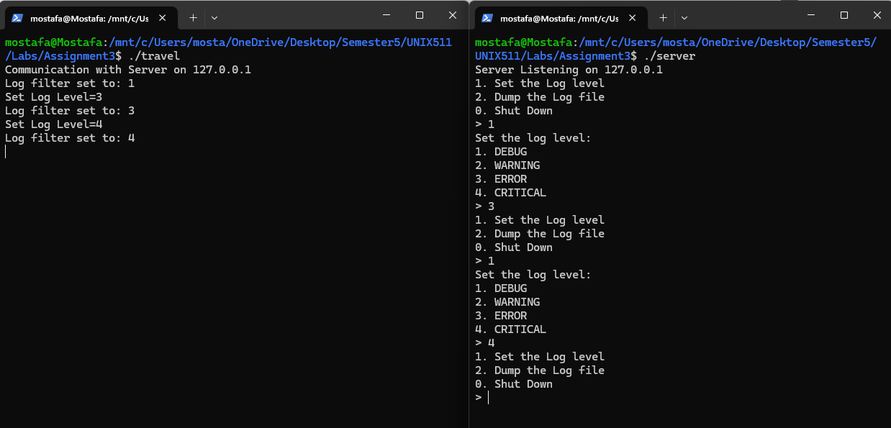

# 🚗 Distributed Logging System with Travel Simulator

This project implements a **distributed logging system** in C++ using **UDP sockets**, with a simulated travel application that generates logs based on automobile activity. It is designed for educational use in understanding client-server communication, logging levels, and multithreaded processing in a Unix/Linux environment.

---

## 📁 Project Structure

```
.
├── Logger.cpp             # Logger client that sends logs to the server
├── LogServer.cpp          # UDP log server that receives and manages logs
├── Automobile.cpp/.h      # Models different vehicle behaviors
├── TravelSimulator.cpp    # Simulates vehicle operations and generates logs
├── Makefile               # Build automation file
└── README.md              # Project documentation
```

---

## ⚙️ Features

- ✅ Client-server architecture using UDP
- ✅ Dynamic logging level control (DEBUG, WARNING, ERROR, CRITICAL)
- ✅ Multithreaded log server to handle incoming messages
- ✅ Embedded log formatting with timestamps, file names, functions, line numbers
- ✅ Log dumping on user request
- ✅ Interactive menu on server side to change level or dump logs
- ✅ Makefile with support for normal and debug builds

---

## 🔧 Build Instructions

Ensure you're on a Unix/Linux system with `g++` and `make` installed.

### 🔨 Compile the project:

```bash
make          # Builds the project normally
make debugbuild  # Builds with DEBUG macro enabled
```

### 🧹 Clean build artifacts:

```bash
make clean
```

---

## 🧪 How to Run

### 1. Start the Log Server

```bash
./server
```

You’ll see options to set log level, dump the log, or shut down the server.

### 2. Run the Travel Simulator

In a **separate terminal**, run:

```bash
./travel
```

It will simulate vehicle operations and send logs to the server over UDP.

---

## 🛠️ Logging Levels

| Level    | Meaning                                |
| -------- | -------------------------------------- |
| DEBUG    | Fine-grained info (requires `-DDEBUG`) |
| WARNING  | Potential issues or progress steps     |
| ERROR    | Problems like overfueling              |
| CRITICAL | Serious failures like no fuel          |

You can change the active level live from the server UI.

---

## 🧠 Concepts Demonstrated

- Asynchronous communication using UDP sockets
- Mutexes for thread-safe access to shared resources
- Signal handling for graceful shutdown
- Server-side log level filtering
- Minimalist custom logging system

---

## 🧪 Screenshots (Optional)

If you'd like to add screenshots to your GitHub repo, create a `screenshots` folder and use this syntax in Markdown:

```md



```

---

## 📌 Notes

- Communication is asynchronous and non-blocking.
- The system was tested on Ubuntu 22.04.
- UDP was chosen to keep the system lightweight.

---

## 📄 License

MIT License — feel free to use, modify, or share.
