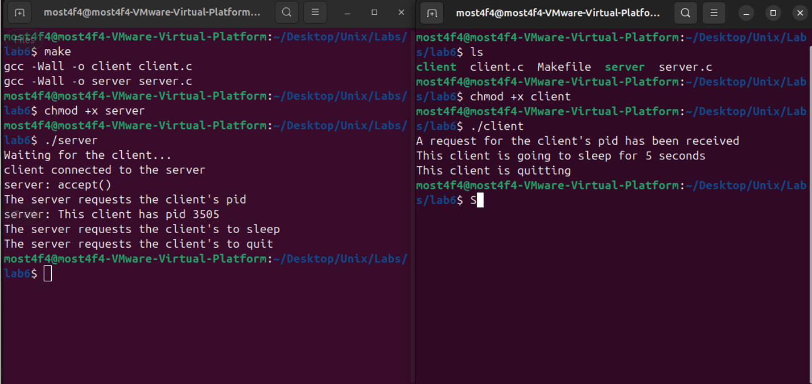

# Unix Domain Socket Client-Server Demo

This project demonstrates a simple **client-server communication** using **UNIX domain sockets** with **TCP (SOCK_STREAM)** type communication on the same machine. It is built in C and showcases how two processes (a client and a server) can interact via a local socket file.

## Overview

- **Domain**: `AF_UNIX` (local machine only)
- **Communication type**: `SOCK_STREAM` (TCP-like)
- **Socket file path**: `/tmp/lab6`
- **Client actions**: Responds to commands like `pid`, `sleep`, and `quit` sent from the server.

---

## File Structure

| File       | Description                                                |
| ---------- | ---------------------------------------------------------- |
| `client.c` | Handles connection to the server and responds to commands. |
| `server.c` | Creates a socket, waits for a client, and sends commands.  |
| `Makefile` | Builds the client and server executables.                  |

---

## Build Instructions

To compile the project, use the provided `Makefile`:

```bash
make
```

This will generate two executables:

- `client`
- `server`

To clean up compiled binaries:

```bash
make clean
```

---

## How to Run

### Step 1: Start the Server

```bash
./server
```

Output:

```
Waiting for the client...
client connected to the server
server: accept()
The server requests the client's pid
server: This client has pid XXXX
The server requests the client's to sleep
The server requests the client's to quit
```

### Step 2: Start the Client (in a new terminal)

```bash
./client
```

Output:

```
A request for the client's pid has been received
This client is going to sleep for 5 seconds
This client is quitting
```

---

## Communication Flow

1. **Connection**:

   - Server sets up a UNIX socket at `/tmp/lab6`.
   - Client connects to this socket.

2. **Command Sequence**:
   - Server sends `pid`, client replies with its process ID.
   - Server sends `sleep`, client sleeps for 5 seconds and replies with "Done".
   - Server sends `quit`, client disconnects and exits.

---

## 🧪 Screenshots



---

## Notes

- The socket file `/tmp/lab6` is unlinked (removed) after server shutdown to clean up.
- Ensure both `server` and `client` run from the same machine since this uses **AF_UNIX** (not over a network).

---

## Requirements

- GCC
- Linux/UNIX-based environment

---

## Author

Created for educational purposes to demonstrate IPC using Unix domain sockets.
