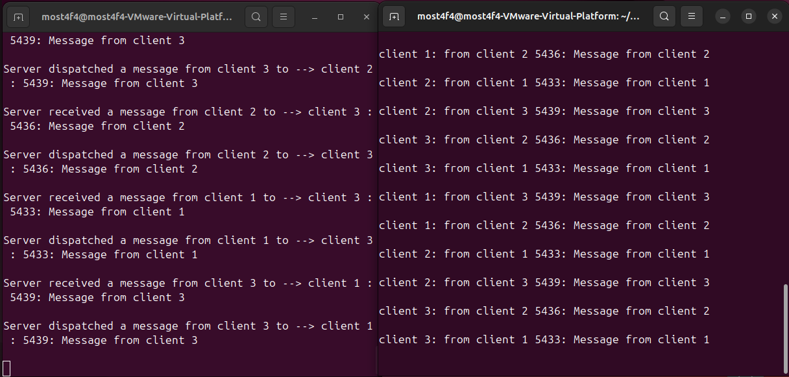
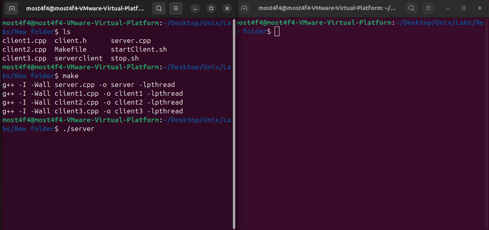
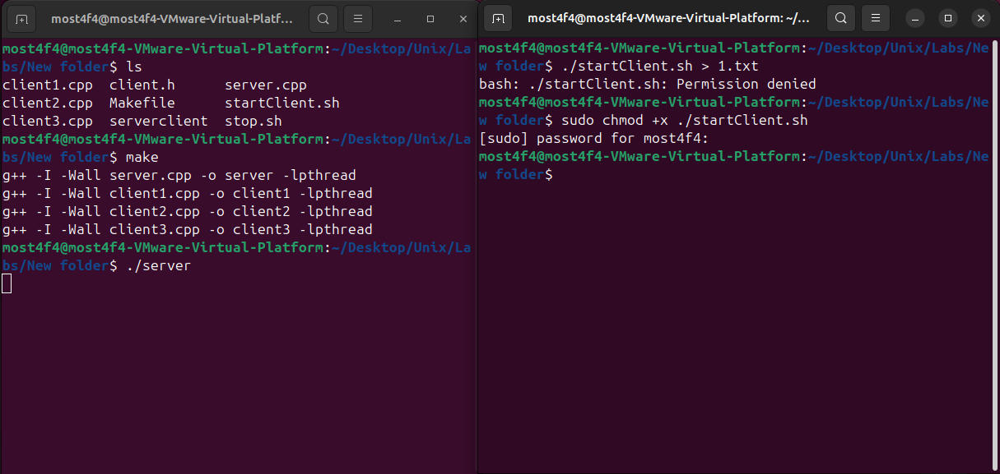
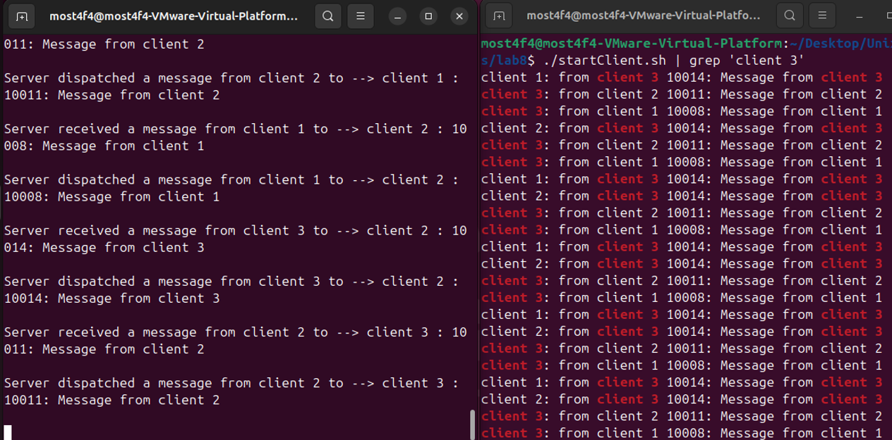
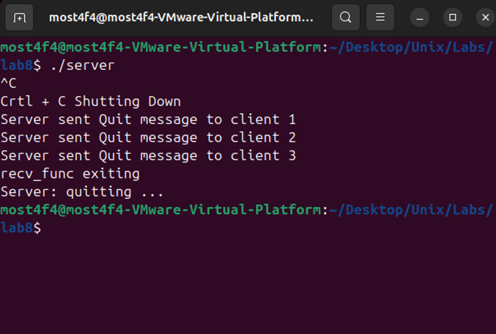

# Message Queue Server-Client Communication System

## Overview

This project implements a **multi-threaded message queue communication system** using **System V Message Queues**, **POSIX threads (pthreads)**, and **mutex synchronization**. The system demonstrates inter-process communication (IPC) where a central server facilitates message exchange between three independent client processes.


_System architecture showing server-client communication flow_

## Key Features

- **Multi-threaded Architecture**: Each client runs receiving threads concurrently with main sending logic
- **Mutex Synchronization**: Thread-safe access to shared message queues using pthread mutexes
- **Message Routing**: Server intelligently routes messages between clients based on destination IDs
- **Graceful Shutdown**: Proper cleanup of resources and controlled termination on SIGINT
- **Round-Robin Communication**: Clients alternate message destinations in a predictable pattern

## System Architecture

### Components

1. **Server (`server.cpp`)**: Central message dispatcher

   - Receives messages from all clients (message type 4)
   - Routes messages to appropriate destinations (message types 1, 2, 3)
   - Handles graceful shutdown with cleanup

2. **Client 1 (`client1.cpp`)**: Alternates between sending to clients 2 and 3
3. **Client 2 (`client2.cpp`)**: Alternates between sending to clients 1 and 3
4. **Client 3 (`client3.cpp`)**: Alternates between sending to clients 1 and 2

### Communication Flow

```
Client 1 ──┐
Client 2 ──┼── (mtype 4) ──► Server ──┬── (mtype 1) ──► Client 1
Client 3 ──┘                          ├── (mtype 2) ──► Client 2
                                      └── (mtype 3) ──► Client 3
```

## Technical Implementation

### Message Structure

```c
const int BUF_LEN = 64;

// Structure for message queue
typedef struct mesg_buffer {
    long source;  // Source client ID (1, 2, or 3)
    long dest;    // Destination client ID (1, 2, or 3)
    char buf[BUF_LEN];  // Message content
} MesgBuffer;

// Structure for message type
typedef struct mymsg {
    long mtype;  // Message type for filtering
    MesgBuffer msgBuf;  // The message payload
} Message;
```

### Message Types & Routing

| Message Type | Purpose           | Direction            |
| ------------ | ----------------- | -------------------- |
| `mtype 4`    | Client-to-Server  | All clients → Server |
| `mtype 1`    | Server-to-Client1 | Server → Client 1    |
| `mtype 2`    | Server-to-Client2 | Server → Client 2    |
| `mtype 3`    | Server-to-Client3 | Server → Client 3    |

### Threading Model

- **Server**:

  - Main thread: Message dispatching and shutdown handling
  - Receive thread (`recv_func`): Non-blocking message reception from clients

- **Clients**:
  - Main thread: Message sending and local queue processing
  - Receive thread (`recv_func1/2/3`): Listening for incoming messages

### Synchronization

- **Mutex Protection**: `pthread_mutex_t lock_x` protects shared message queues
- **Thread Safety**: All queue operations (push/pop) are mutex-protected
- **Signal Handling**: SIGINT handlers ensure graceful shutdown

## Build and Run Instructions

### Prerequisites

- Linux environment (tested on Ubuntu/VMware)
- `g++` compiler with C++11 support
- POSIX threading library (`-lpthread`)
- System V Message Queue support

### 1. Compile All Components

```bash
make
```

This creates executables: `server`, `client1`, `client2`, `client3`

### 2. Start the Server

```bash
./server
```


_Successful compilation + Server initialization and waiting for client connections_

### 3. Start All Clients

```bash
chmod +x ./startClient.sh
./startClient.sh
```


_Start All Clients_

The script starts clients with staggered delays:

- Client 1 starts immediately
- Client 2 starts after 0.7 seconds
- Client 3 starts after 1.4 seconds

### 4. Monitor Communication

Once running, you'll see real-time message exchange:

```
Server received a message from client 1 to --> client 2 : 1234: Message from client 1
Server dispatched a message from client 1 to --> client 2 : 1234: Message from client 1
client 2: from client 1 1234: Message from client 1
```


_Real-time message exchange between clients through server_

### 5. Testing Individual Client Communication

Filter output to observe specific client behavior:

```bash
./startClient.sh | grep 'client 3'
```


_Filtered output showing only Client 3 messages_

### 6. Graceful Shutdown

Stop the server with `Ctrl+C`:

```bash
# The server will:
# 1. Send "Quit" messages to all clients
# 2. Wait for threads to join
# 3. Clean up message queue resources
```


_Server performing graceful shutdown and resource cleanup_

Alternative forced shutdown:

```bash
./stop.sh
```

## Code Highlights

### Server Implementation

**Key Features:**

- **Non-blocking Message Reception**: Uses `IPC_NOWAIT` to prevent blocking
- **Thread Synchronization**: Mutex-protected shared queue access
- **Resource Management**: Proper cleanup of message queues and threads

```cpp
// Non-blocking message reception in server
if (msgrcv(msgid, &msg, sizeof(msg), 4, IPC_NOWAIT) == -1) {
    if (errno == ENOMSG) { // No message available
        usleep(1000); // Brief sleep to avoid busy-waiting
        continue;
    }
    // Handle other errors...
}
```

### Client Implementation

**Key Features:**

- **Round-Robin Destination Logic**: Alternating target clients
- **Thread-Safe Queue Management**: Mutex protection for local message queues
- **Signal Handling**: Clean shutdown on SIGINT

```cpp
// Client 1's alternating destination logic
if(dest==2) dest=3;
else        dest=2;
```

## Testing and Validation

### Message Delivery Verification

1. **Bidirectional Communication**: Each client can both send and receive
2. **Message Ordering**: FIFO queue ensures proper message sequence
3. **Thread Safety**: No race conditions in queue access
4. **Resource Cleanup**: Proper pthread and message queue cleanup

### Performance Characteristics

- **Throughput**: 1 message per second per client (configurable via `sleep(1)`)
- **Latency**: Near real-time message delivery
- **Scalability**: Easily extensible to more clients

## File Structure

```
├── Makefile              # Build configuration
├── README.md            # This documentation
├── client.h             # Shared message structures
├── server.cpp           # Server implementation
├── client1.cpp          # Client 1 implementation
├── client2.cpp          # Client 2 implementation
├── client3.cpp          # Client 3 implementation
├── startClient.sh       # Client startup script
├── stop.sh             # Forced shutdown script
└── serverclient        # IPC key file (created by ftok)
```

## Learning Outcomes

This project demonstrates:

1. **Inter-Process Communication (IPC)**: System V Message Queues
2. **Multi-threading**: POSIX threads with proper synchronization
3. **Mutex Usage**: Thread-safe shared resource access
4. **Signal Handling**: Graceful program termination
5. **Process Management**: Concurrent process coordination
6. **Resource Management**: Proper cleanup of system resources

## Troubleshooting

### Common Issues

1. **Permission Denied on Script Execution**

   ```bash
   chmod +x ./startClient.sh
   chmod +x ./stop.sh
   ```

2. **Message Queue Already Exists**

   ```bash
   ipcs -q  # List message queues
   ipcrm -q <msgqid>  # Remove specific queue
   ```

3. **Zombie Processes**
   ```bash
   ps aux | grep client
   pkill -9 client1 client2 client3
   ```

## Dependencies

- **Compiler**: g++ with C++11 support
- **Libraries**:
  - `pthread` (POSIX threads)
  - System V IPC (message queues)
- **OS**: Linux (tested on Ubuntu in VMware)

## Video Demonstration

[📹 YouTube Demo](https://youtu.be/ZGt9NCoK3uE) - Complete system walkthrough

## Future Enhancements

- **Dynamic Client Registration**: Support variable number of clients
- **Message Acknowledgments**: Ensure reliable message delivery
- **Load Balancing**: Distribute messages across available clients
- **Persistent Queues**: Message persistence across restarts
- **Web Interface**: Real-time monitoring dashboard

## License

This program is for educational purposes and is free to use and modify.

## Author

**Mostafa Hasanalipourshahrabadi**

- Developed and tested on Linux VM
- Demonstrates advanced IPC and threading concepts

---

_For technical questions or improvements, please refer to the source code comments or create an issue._
